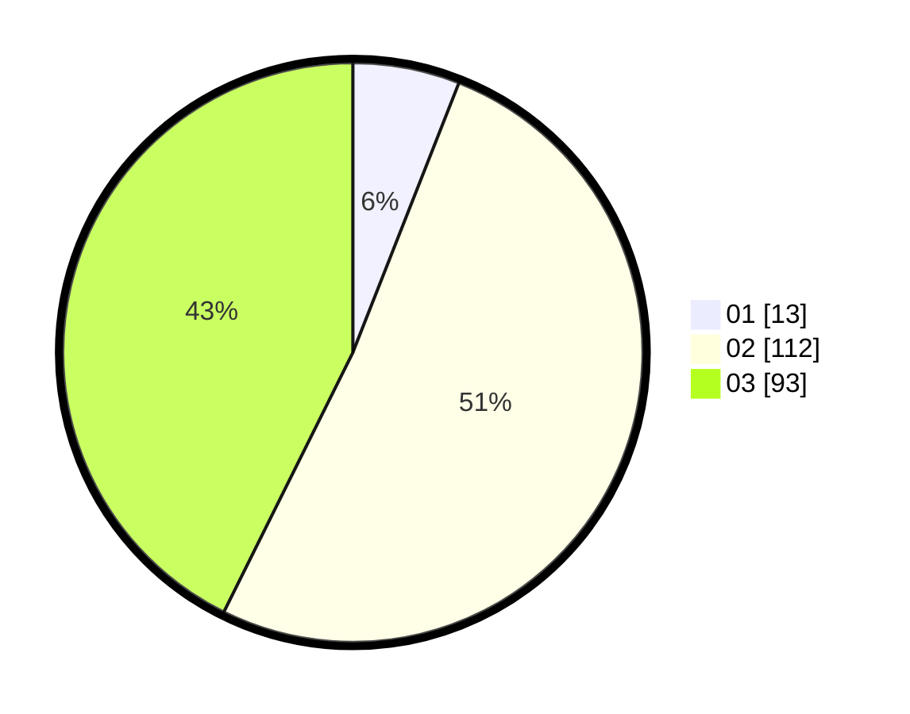

# Hasil

Hasil perolehan suara paslon dapat dilihat pada file paslon-01.txt, paslon-02.txt, dan paslon-03.txt.

Jika tidak ada, artinya data tersebut belum ada pada SIREKAP.

## Perolehan Suara

 * Paslon 01: **13**.
 * Paslon 02: **112**.
 * Paslon 03: **93**.

## Foto C Plano

https://sirekap-obj-formc.kpu.go.id/f49d/pemilu/ppwp/31/73/06/10/01/3173061001124-20240214-191324--d7fd8b0e-d3f9-4572-8f7d-f47265fad114.jpg

https://sirekap-obj-formc.kpu.go.id/f49d/pemilu/ppwp/31/73/06/10/01/3173061001124-20240214-191348--ea7f1d85-a1d5-4d92-97f5-34a3656de4e3.jpg

https://sirekap-obj-formc.kpu.go.id/f49d/pemilu/ppwp/31/73/06/10/01/3173061001124-20240214-191355--68b2906a-9e02-4774-880a-95b299d188c0.jpg

## DATA PEMILIH TETAP

Jumlah pemilih dalam DPT: **283**.
 * L: **125**.
 * P: **158**.

## DATA PENGGUNA HAK PILIH

Jumlah pengguna hak pilih dalam DPT: **219**.
 * L: **99**.
 * P: **120**.

Jumlah pengguna hak pilih dalam DPTb: **8**.
 * L: **3**.
 * P: **5**.

Jumlah pengguna hak pilih dalam DPK: **0**.
 * L: **0**.
 * P: **0**.

Jumlah pengguna hak pilih: **227**.
 * L: **102**.
 * P: **125**.

## JUMLAH SUARA SAH DAN TIDAK SAH

JUMLAH SELURUH SUARA SAH: **218**.

JUMLAH SUARA TIDAK SAH: **10**.

JUMLAH SELURUH SUARA SAH DAN SUARA TIDAK SAH: **228**.
