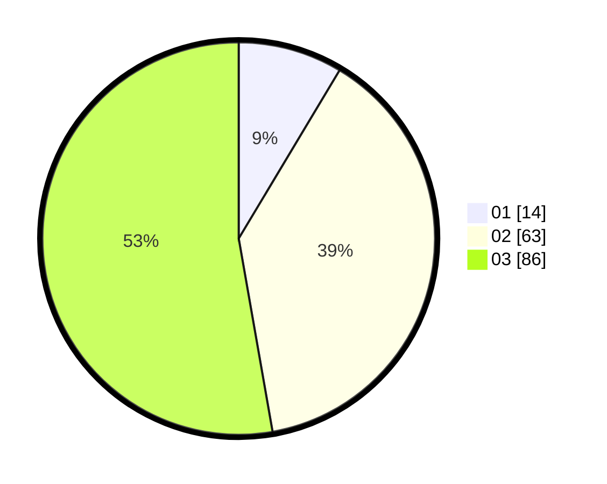

# Hasil

Hasil perolehan suara paslon dapat dilihat pada file paslon-01.txt, paslon-02.txt, dan paslon-03.txt.

Jika tidak ada, artinya data tersebut belum ada pada SIREKAP.

## Perolehan Suara

 * Paslon 01: **14**.
 * Paslon 02: **63**.
 * Paslon 03: **86**.

## Foto C Plano

https://sirekap-obj-formc.kpu.go.id/114d/pemilu/ppwp/31/73/06/10/01/3173061001125-20240214-190414--958d820e-b1c0-43f8-95cb-b7ed69da1635.jpg

https://sirekap-obj-formc.kpu.go.id/114d/pemilu/ppwp/31/73/06/10/01/3173061001125-20240214-212004--d483b2a8-4d26-42bf-aadd-7cd298702dd9.jpg

https://sirekap-obj-formc.kpu.go.id/114d/pemilu/ppwp/31/73/06/10/01/3173061001125-20240214-190611--95169eed-5065-46d5-a58d-16ff3954c5ab.jpg

## DATA PEMILIH TETAP

Jumlah pemilih dalam DPT: **211**.
 * L: **89**.
 * P: **122**.

## DATA PENGGUNA HAK PILIH

Jumlah pengguna hak pilih dalam DPT: **161**.
 * L: **65**.
 * P: **96**.

Jumlah pengguna hak pilih dalam DPTb: **3**.
 * L: **2**.
 * P: **1**.

Jumlah pengguna hak pilih dalam DPK: **2**.
 * L: **2**.
 * P: **0**.

Jumlah pengguna hak pilih: **166**.
 * L: **69**.
 * P: **97**.

## JUMLAH SUARA SAH DAN TIDAK SAH

JUMLAH SELURUH SUARA SAH: **163**.

JUMLAH SUARA TIDAK SAH: **3**.

JUMLAH SELURUH SUARA SAH DAN SUARA TIDAK SAH: **166**.
