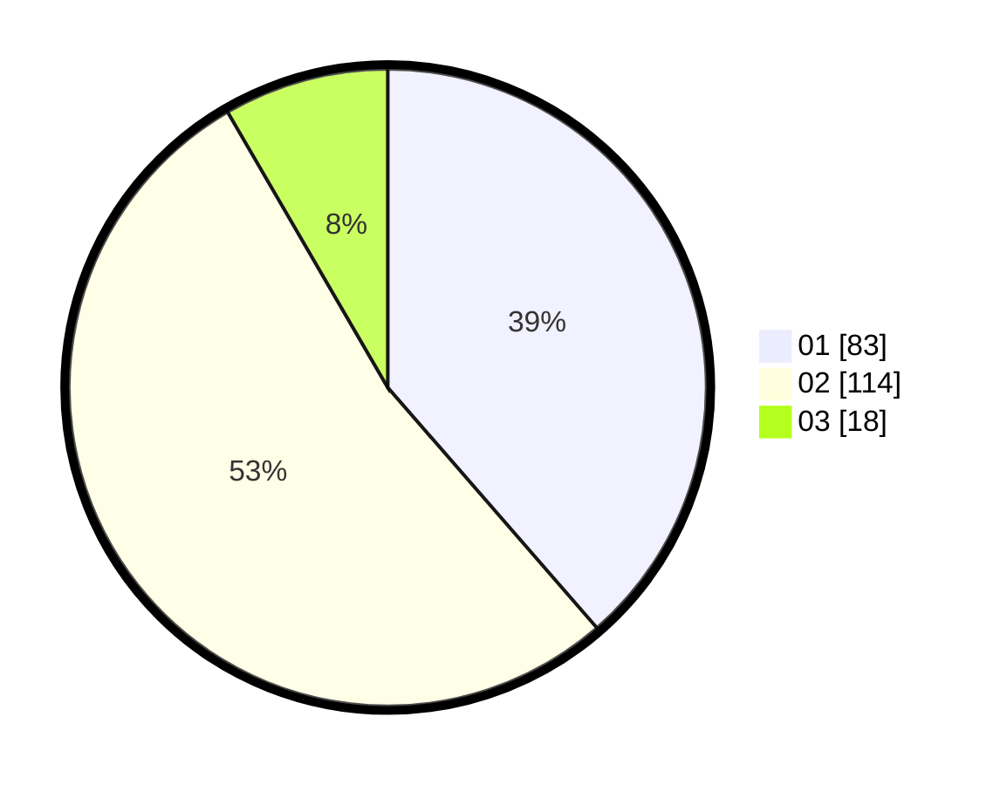

# Hasil

Hasil perolehan suara paslon dapat dilihat pada file paslon-01.txt, paslon-02.txt, dan paslon-03.txt.

Jika tidak ada, artinya data tersebut belum ada pada SIREKAP.

## Perolehan Suara

 * Paslon 01: **83**.
 * Paslon 02: **114**.
 * Paslon 03: **18**.

## Foto C Plano

https://sirekap-obj-formc.kpu.go.id/c3b4/pemilu/ppwp/31/73/06/10/01/3173061001126-20240214-191543--ea4bd992-f1d4-4cf3-8790-23dd5decaf88.jpg

https://sirekap-obj-formc.kpu.go.id/c3b4/pemilu/ppwp/31/73/06/10/01/3173061001126-20240214-191602--c57a0fd0-9c84-46b1-ba0b-60887854d215.jpg

https://sirekap-obj-formc.kpu.go.id/c3b4/pemilu/ppwp/31/73/06/10/01/3173061001126-20240214-191611--a368c456-0054-47ec-91d5-97e77b9f3c82.jpg

## DATA PEMILIH TETAP

Jumlah pemilih dalam DPT: **286**.
 * L: **149**.
 * P: **137**.

## DATA PENGGUNA HAK PILIH

Jumlah pengguna hak pilih dalam DPT: **219**.
 * L: **101**.
 * P: **118**.

Jumlah pengguna hak pilih dalam DPTb: **0**.
 * L: **0**.
 * P: **0**.

Jumlah pengguna hak pilih dalam DPK: **0**.
 * L: **0**.
 * P: **0**.

Jumlah pengguna hak pilih: **219**.
 * L: **101**.
 * P: **118**.

## JUMLAH SUARA SAH DAN TIDAK SAH

JUMLAH SELURUH SUARA SAH: **215**.

JUMLAH SUARA TIDAK SAH: **4**.

JUMLAH SELURUH SUARA SAH DAN SUARA TIDAK SAH: **219**.
