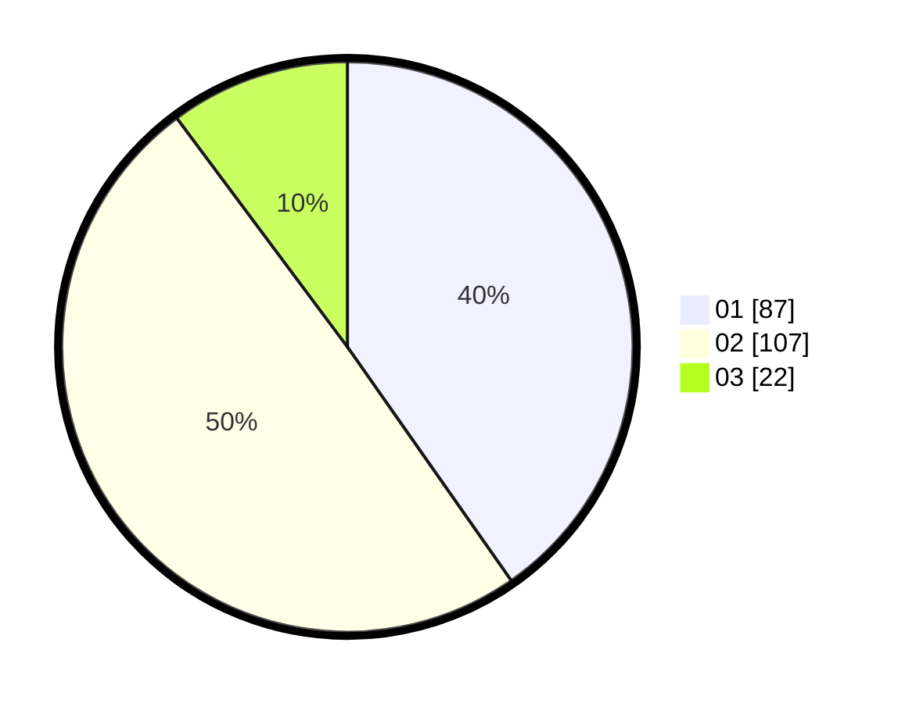

# Hasil

Hasil perolehan suara paslon dapat dilihat pada file paslon-01.txt, paslon-02.txt, dan paslon-03.txt.

Jika tidak ada, artinya data tersebut belum ada pada SIREKAP.

## Perolehan Suara

 * Paslon 01: **87**.
 * Paslon 02: **107**.
 * Paslon 03: **22**.

## Foto C Plano

https://sirekap-obj-formc.kpu.go.id/0095/pemilu/ppwp/31/73/06/10/01/3173061001129-20240214-191922--74901cc9-ed44-4043-9c89-bb3159f166aa.jpg

https://sirekap-obj-formc.kpu.go.id/0095/pemilu/ppwp/31/73/06/10/01/3173061001129-20240216-025355--053b343b-b1b0-41c8-9de9-321b77b66608.jpg

https://sirekap-obj-formc.kpu.go.id/0095/pemilu/ppwp/31/73/06/10/01/3173061001129-20240214-205342--3c58d756-967a-430f-abf1-cc3e90c12289.jpg

## DATA PEMILIH TETAP

Jumlah pemilih dalam DPT: **293**.
 * L: **150**.
 * P: **143**.

## DATA PENGGUNA HAK PILIH

Jumlah pengguna hak pilih dalam DPT: **222**.
 * L: **113**.
 * P: **109**.

Jumlah pengguna hak pilih dalam DPTb: **0**.
 * L: **0**.
 * P: **0**.

Jumlah pengguna hak pilih dalam DPK: **5**.
 * L: **3**.
 * P: **2**.

Jumlah pengguna hak pilih: **227**.
 * L: **116**.
 * P: **111**.

## JUMLAH SUARA SAH DAN TIDAK SAH

JUMLAH SELURUH SUARA SAH: **216**.

JUMLAH SUARA TIDAK SAH: **11**.

JUMLAH SELURUH SUARA SAH DAN SUARA TIDAK SAH: **227**.
