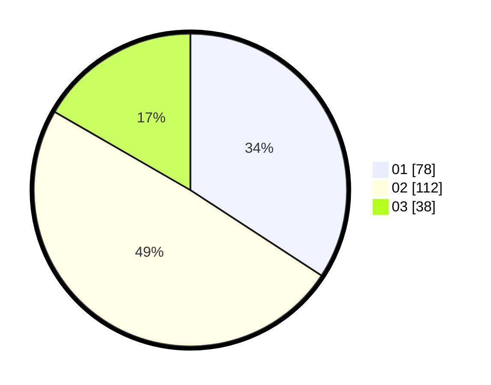

# Hasil

Hasil perolehan suara paslon dapat dilihat pada file paslon-01.txt, paslon-02.txt, dan paslon-03.txt.

Jika tidak ada, artinya data tersebut belum ada pada SIREKAP.

## Perolehan Suara

 * Paslon 01: **78**.
 * Paslon 02: **112**.
 * Paslon 03: **38**.

## Foto C Plano

https://sirekap-obj-formc.kpu.go.id/7274/pemilu/ppwp/31/73/06/10/01/3173061001131-20240214-155923--13ff52af-473f-42ee-90e5-597bc9f2188b.jpg

https://sirekap-obj-formc.kpu.go.id/7274/pemilu/ppwp/31/73/06/10/01/3173061001131-20240214-160158--d553da3d-6a74-4416-82b4-d47b31f1f0ce.jpg
