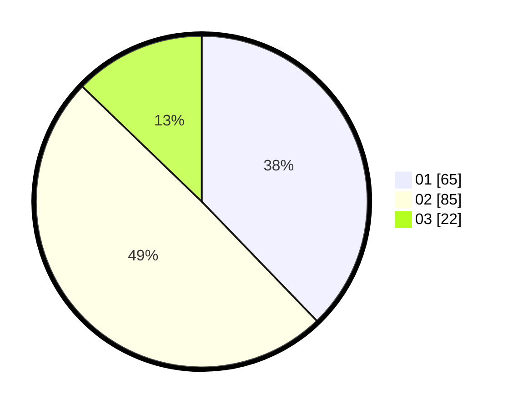

# Hasil

Hasil perolehan suara paslon dapat dilihat pada file paslon-01.txt, paslon-02.txt, dan paslon-03.txt.

Jika tidak ada, artinya data tersebut belum ada pada SIREKAP.

## Perolehan Suara

 * Paslon 01: **65**.
 * Paslon 02: **85**.
 * Paslon 03: **22**.

## Foto C Plano

https://sirekap-obj-formc.kpu.go.id/866d/pemilu/ppwp/31/73/06/10/01/3173061001136-20240216-175759--111aa580-217a-4f1c-87da-1a90b97fc208.jpg

https://sirekap-obj-formc.kpu.go.id/866d/pemilu/ppwp/31/73/06/10/01/3173061001136-20240216-175801--d9cdb5fc-69a0-464f-afc5-b7a5dfd00ef3.jpg

https://sirekap-obj-formc.kpu.go.id/866d/pemilu/ppwp/31/73/06/10/01/3173061001136-20240216-175800--4dcd9f3b-6cb6-4163-8bfd-4c4b86c97920.jpg

## DATA PEMILIH TETAP

Jumlah pemilih dalam DPT: **170**.
 * L: **88**.
 * P: **82**.

## DATA PENGGUNA HAK PILIH

Jumlah pengguna hak pilih dalam DPT: **170**.
 * L: **88**.
 * P: **82**.

Jumlah pengguna hak pilih dalam DPTb: **1**.
 * L: **0**.
 * P: **1**.

Jumlah pengguna hak pilih dalam DPK: **4**.
 * L: **2**.
 * P: **2**.

Jumlah pengguna hak pilih: **175**.
 * L: **90**.
 * P: **85**.

## JUMLAH SUARA SAH DAN TIDAK SAH

JUMLAH SELURUH SUARA SAH: **172**.

JUMLAH SUARA TIDAK SAH: **4**.

JUMLAH SELURUH SUARA SAH DAN SUARA TIDAK SAH: **176**.
