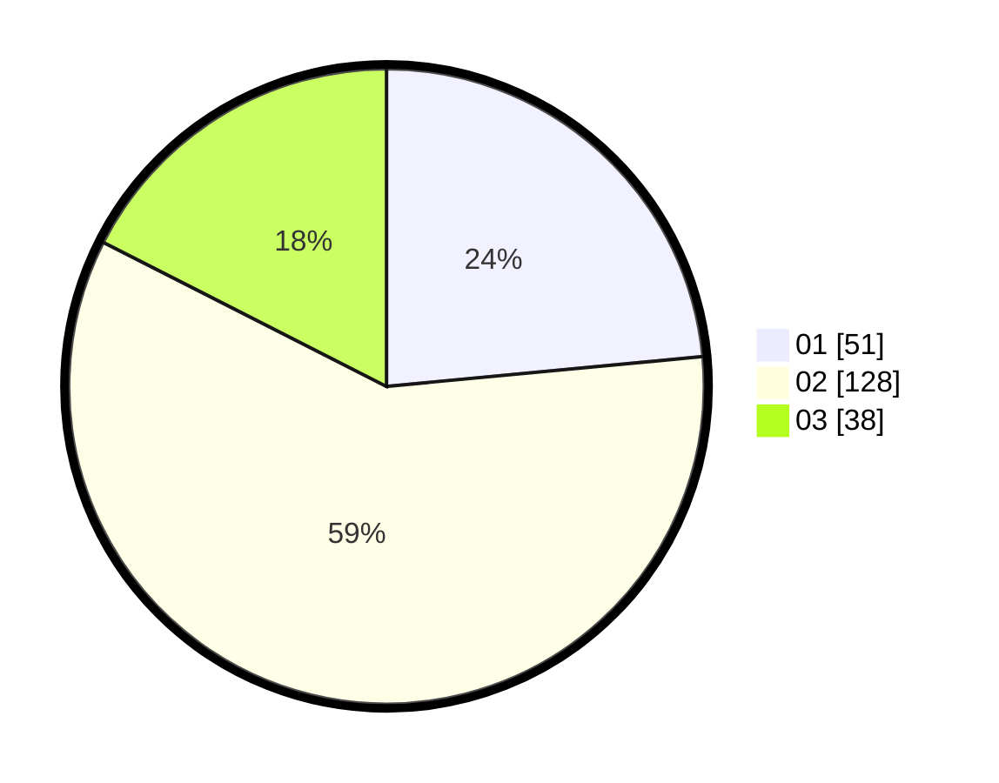

# Hasil

Hasil perolehan suara paslon dapat dilihat pada file paslon-01.txt, paslon-02.txt, dan paslon-03.txt.

Jika tidak ada, artinya data tersebut belum ada pada SIREKAP.

## Perolehan Suara

 * Paslon 01: **51**.
 * Paslon 02: **128**.
 * Paslon 03: **38**.

## Foto C Plano

https://sirekap-obj-formc.kpu.go.id/d3e0/pemilu/ppwp/31/73/06/10/01/3173061001139-20240216-134349--f1740e3a-346d-4935-9f92-aabaabc4f852.jpg

https://sirekap-obj-formc.kpu.go.id/d3e0/pemilu/ppwp/31/73/06/10/01/3173061001139-20240216-134350--ca5aaf89-1335-4ed4-a894-42577725cec3.jpg

https://sirekap-obj-formc.kpu.go.id/d3e0/pemilu/ppwp/31/73/06/10/01/3173061001139-20240216-134350--bcd8ddde-bfe9-4890-ac32-3fc41760d6df.jpg

## DATA PEMILIH TETAP

Jumlah pemilih dalam DPT: **293**.
 * L: **151**.
 * P: **142**.

## DATA PENGGUNA HAK PILIH

Jumlah pengguna hak pilih dalam DPT: **219**.
 * L: **109**.
 * P: **110**.

Jumlah pengguna hak pilih dalam DPTb: **2**.
 * L: **2**.
 * P: **0**.

Jumlah pengguna hak pilih dalam DPK: **3**.
 * L: **2**.
 * P: **1**.

Jumlah pengguna hak pilih: **224**.
 * L: **113**.
 * P: **111**.

## JUMLAH SUARA SAH DAN TIDAK SAH

JUMLAH SELURUH SUARA SAH: **217**.

JUMLAH SUARA TIDAK SAH: **7**.

JUMLAH SELURUH SUARA SAH DAN SUARA TIDAK SAH: **224**.
