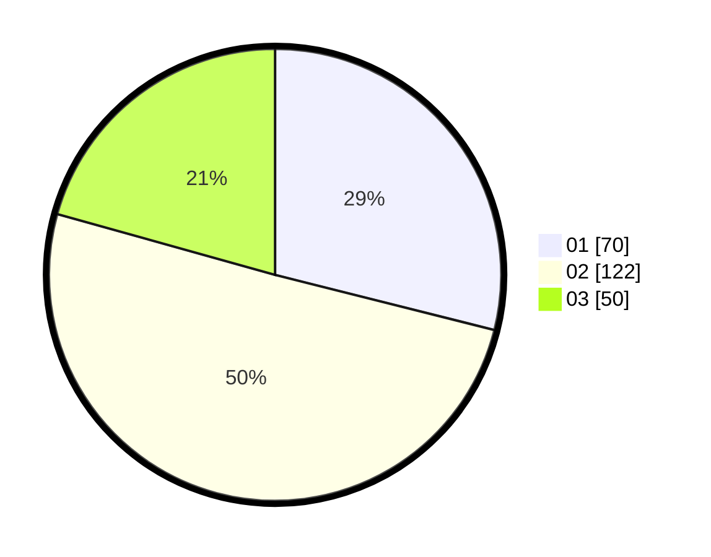

# Hasil

Hasil perolehan suara paslon dapat dilihat pada file paslon-01.txt, paslon-02.txt, dan paslon-03.txt.

Jika tidak ada, artinya data tersebut belum ada pada SIREKAP.

## Perolehan Suara

 * Paslon 01: **70**.
 * Paslon 02: **122**.
 * Paslon 03: **50**.

## Foto C Plano

https://sirekap-obj-formc.kpu.go.id/728c/pemilu/ppwp/31/73/06/10/01/3173061001142-20240216-145526--67d91960-b429-4a39-b4dd-0d6872c0fabe.jpg

https://sirekap-obj-formc.kpu.go.id/728c/pemilu/ppwp/31/73/06/10/01/3173061001142-20240216-145527--06c5d8c9-2c39-407f-a4e0-10a5d1176e8f.jpg

https://sirekap-obj-formc.kpu.go.id/728c/pemilu/ppwp/31/73/06/10/01/3173061001142-20240216-145527--910a0190-19be-45da-ba3a-ae9f267d0930.jpg

## DATA PEMILIH TETAP

Jumlah pemilih dalam DPT: **300**.
 * L: **155**.
 * P: **145**.

## DATA PENGGUNA HAK PILIH

Jumlah pengguna hak pilih dalam DPT: **247**.
 * L: **128**.
 * P: **119**.

Jumlah pengguna hak pilih dalam DPTb: **2**.
 * L: **2**.
 * P: **0**.

Jumlah pengguna hak pilih dalam DPK: **0**.
 * L: **0**.
 * P: **0**.

Jumlah pengguna hak pilih: **249**.
 * L: **130**.
 * P: **119**.

## JUMLAH SUARA SAH DAN TIDAK SAH

JUMLAH SELURUH SUARA SAH: **242**.

JUMLAH SUARA TIDAK SAH: **7**.

JUMLAH SELURUH SUARA SAH DAN SUARA TIDAK SAH: **249**.
