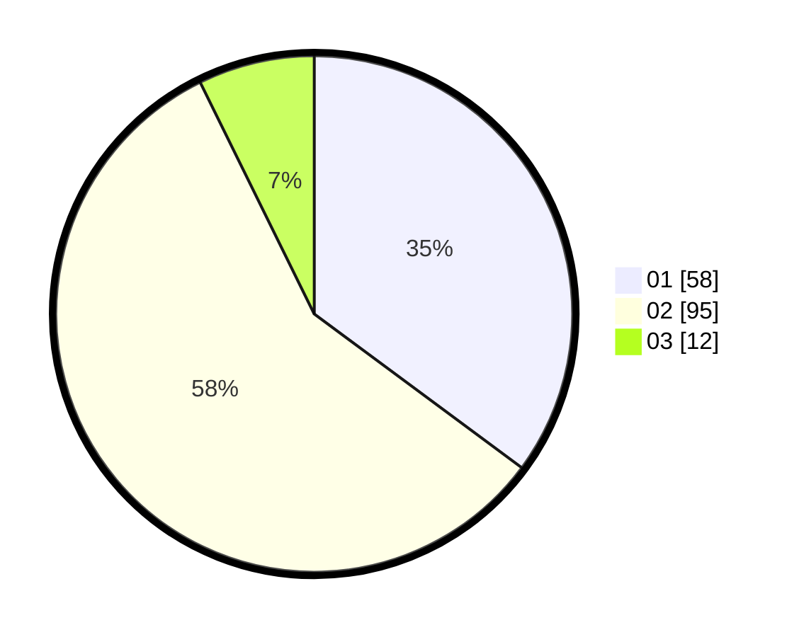

# Hasil

Hasil perolehan suara paslon dapat dilihat pada file paslon-01.txt, paslon-02.txt, dan paslon-03.txt.

Jika tidak ada, artinya data tersebut belum ada pada SIREKAP.

## Perolehan Suara

 * Paslon 01: **58**.
 * Paslon 02: **95**.
 * Paslon 03: **12**.

## Foto C Plano

https://sirekap-obj-formc.kpu.go.id/83b3/pemilu/ppwp/31/73/06/10/01/3173061001145-20240214-202451--73224cf8-d318-4a43-a81b-bb6fe7860fab.jpg

https://sirekap-obj-formc.kpu.go.id/83b3/pemilu/ppwp/31/73/06/10/01/3173061001145-20240214-202617--25587145-b640-4ebe-8c67-291826d28438.jpg

https://sirekap-obj-formc.kpu.go.id/83b3/pemilu/ppwp/31/73/06/10/01/3173061001145-20240214-202648--220f5de6-773d-464d-9273-d4359b4aa9be.jpg

## DATA PEMILIH TETAP

Jumlah pemilih dalam DPT: **221**.
 * L: **119**.
 * P: **102**.

## DATA PENGGUNA HAK PILIH

Jumlah pengguna hak pilih dalam DPT: **164**.
 * L: **83**.
 * P: **81**.

Jumlah pengguna hak pilih dalam DPTb: **1**.
 * L: **0**.
 * P: **1**.

Jumlah pengguna hak pilih dalam DPK: **0**.
 * L: **0**.
 * P: **0**.

Jumlah pengguna hak pilih: **165**.
 * L: **83**.
 * P: **82**.

## JUMLAH SUARA SAH DAN TIDAK SAH

JUMLAH SELURUH SUARA SAH: **165**.

JUMLAH SUARA TIDAK SAH: **0**.

JUMLAH SELURUH SUARA SAH DAN SUARA TIDAK SAH: **165**.
