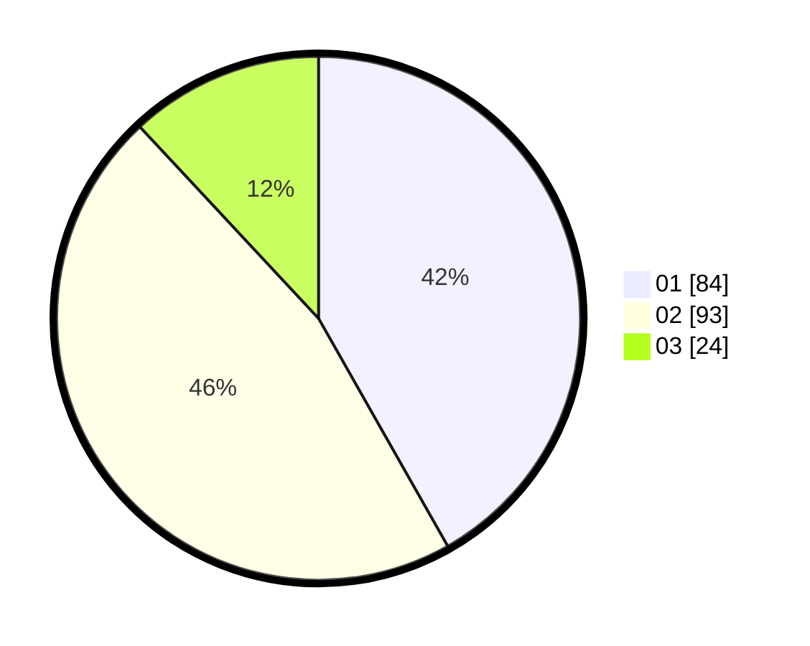

# Hasil

Hasil perolehan suara paslon dapat dilihat pada file paslon-01.txt, paslon-02.txt, dan paslon-03.txt.

Jika tidak ada, artinya data tersebut belum ada pada SIREKAP.

## Perolehan Suara

 * Paslon 01: **84**.
 * Paslon 02: **93**.
 * Paslon 03: **24**.

## Foto C Plano

https://sirekap-obj-formc.kpu.go.id/65d3/pemilu/ppwp/31/73/06/10/01/3173061001149-20240214-225835--cd3f00f5-a8b7-4560-83c0-d6fb67b5b708.jpg

https://sirekap-obj-formc.kpu.go.id/65d3/pemilu/ppwp/31/73/06/10/01/3173061001149-20240214-225950--4b937e0f-4e0f-44b6-a7f2-e4e7c4702a82.jpg

https://sirekap-obj-formc.kpu.go.id/65d3/pemilu/ppwp/31/73/06/10/01/3173061001149-20240214-230114--af47cbc1-0ea7-44a7-afe4-91115b672553.jpg
