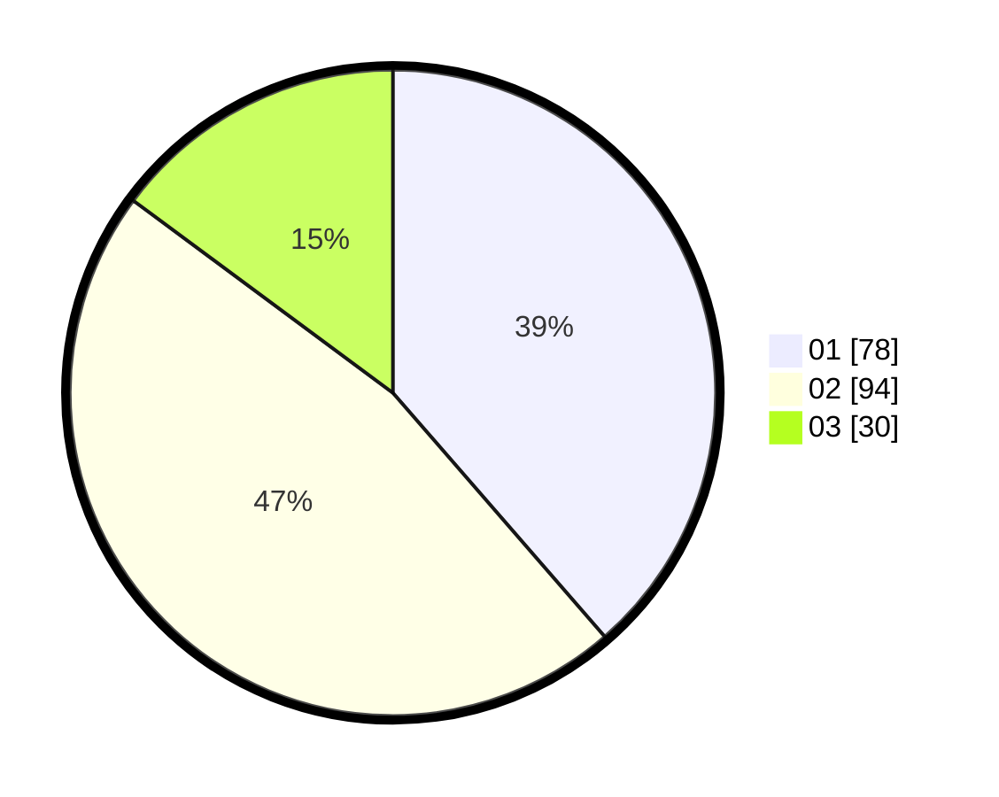

# Hasil

Hasil perolehan suara paslon dapat dilihat pada file paslon-01.txt, paslon-02.txt, dan paslon-03.txt.

Jika tidak ada, artinya data tersebut belum ada pada SIREKAP.

## Perolehan Suara

 * Paslon 01: **78**.
 * Paslon 02: **94**.
 * Paslon 03: **30**.

## Foto C Plano

https://sirekap-obj-formc.kpu.go.id/d1ea/pemilu/ppwp/31/73/06/10/01/3173061001152-20240216-065212--0977d807-fedf-499c-b656-2d1bf98dcd4b.jpg

https://sirekap-obj-formc.kpu.go.id/d1ea/pemilu/ppwp/31/73/06/10/01/3173061001152-20240215-144343--d6e31c88-fbab-4fde-ae4a-42e7cffac2b8.jpg

https://sirekap-obj-formc.kpu.go.id/d1ea/pemilu/ppwp/31/73/06/10/01/3173061001152-20240216-065055--81145c75-6339-4eb8-b7d8-54ada22d028c.jpg
