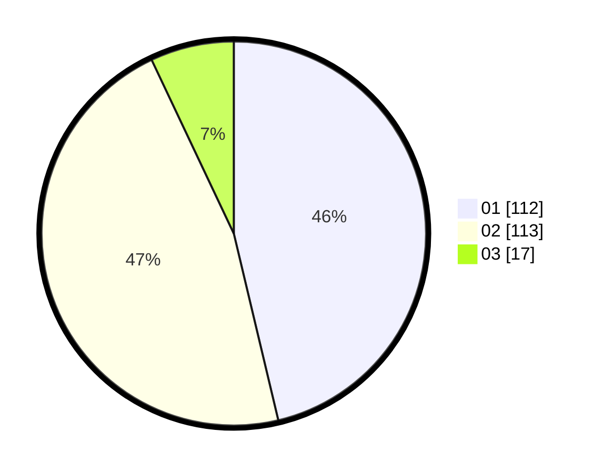

# Hasil

Hasil perolehan suara paslon dapat dilihat pada file paslon-01.txt, paslon-02.txt, dan paslon-03.txt.

Jika tidak ada, artinya data tersebut belum ada pada SIREKAP.

## Perolehan Suara

 * Paslon 01: **112**.
 * Paslon 02: **113**.
 * Paslon 03: **17**.

## Foto C Plano

https://sirekap-obj-formc.kpu.go.id/57c7/pemilu/ppwp/31/73/06/10/01/3173061001153-20240214-205003--665ac089-8163-4f9c-b274-d6a2b791bb7b.jpg

https://sirekap-obj-formc.kpu.go.id/57c7/pemilu/ppwp/31/73/06/10/01/3173061001153-20240214-205013--b43e15dd-692f-4126-a9ab-db3527a70f98.jpg

https://sirekap-obj-formc.kpu.go.id/57c7/pemilu/ppwp/31/73/06/10/01/3173061001153-20240214-205018--aaf1b1e8-b992-4dca-a26e-ff46b60c0478.jpg

## DATA PEMILIH TETAP

Jumlah pemilih dalam DPT: **289**.
 * L: **146**.
 * P: **143**.

## DATA PENGGUNA HAK PILIH

Jumlah pengguna hak pilih dalam DPT: **241**.
 * L: **118**.
 * P: **123**.

Jumlah pengguna hak pilih dalam DPTb: **0**.
 * L: **0**.
 * P: **0**.

Jumlah pengguna hak pilih dalam DPK: **4**.
 * L: **2**.
 * P: **2**.

Jumlah pengguna hak pilih: **245**.
 * L: **120**.
 * P: **125**.

## JUMLAH SUARA SAH DAN TIDAK SAH

JUMLAH SELURUH SUARA SAH: **242**.

JUMLAH SUARA TIDAK SAH: **3**.

JUMLAH SELURUH SUARA SAH DAN SUARA TIDAK SAH: **245**.
