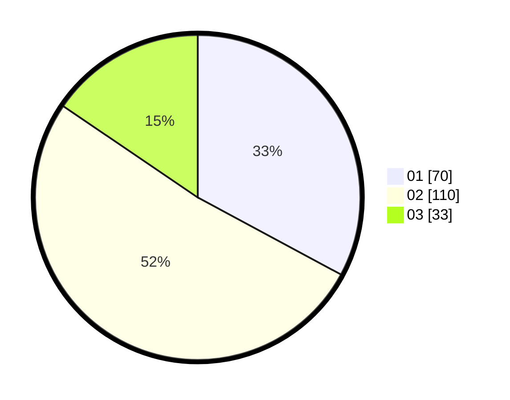

# Hasil

Hasil perolehan suara paslon dapat dilihat pada file paslon-01.txt, paslon-02.txt, dan paslon-03.txt.

Jika tidak ada, artinya data tersebut belum ada pada SIREKAP.

## Perolehan Suara

 * Paslon 01: **70**.
 * Paslon 02: **110**.
 * Paslon 03: **33**.

## Foto C Plano

https://sirekap-obj-formc.kpu.go.id/975e/pemilu/ppwp/31/73/06/10/01/3173061001156-20240214-225344--bf5e8eb2-c217-4aca-a78b-36fa03c91722.jpg

https://sirekap-obj-formc.kpu.go.id/975e/pemilu/ppwp/31/73/06/10/01/3173061001156-20240214-195921--0c33aab8-4381-4826-8479-1994f2f5cbe3.jpg

https://sirekap-obj-formc.kpu.go.id/975e/pemilu/ppwp/31/73/06/10/01/3173061001156-20240214-200206--5461d389-6f30-4bf8-ba0a-45419d65391d.jpg

## DATA PEMILIH TETAP

Jumlah pemilih dalam DPT: **281**.
 * L: **148**.
 * P: **133**.

## DATA PENGGUNA HAK PILIH

Jumlah pengguna hak pilih dalam DPT: **215**.
 * L: **109**.
 * P: **106**.

Jumlah pengguna hak pilih dalam DPTb: **1**.
 * L: **0**.
 * P: **1**.

Jumlah pengguna hak pilih dalam DPK: **1**.
 * L: **1**.
 * P: **0**.

Jumlah pengguna hak pilih: **217**.
 * L: **110**.
 * P: **107**.

## JUMLAH SUARA SAH DAN TIDAK SAH

JUMLAH SELURUH SUARA SAH: **213**.

JUMLAH SUARA TIDAK SAH: **4**.

JUMLAH SELURUH SUARA SAH DAN SUARA TIDAK SAH: **217**.
