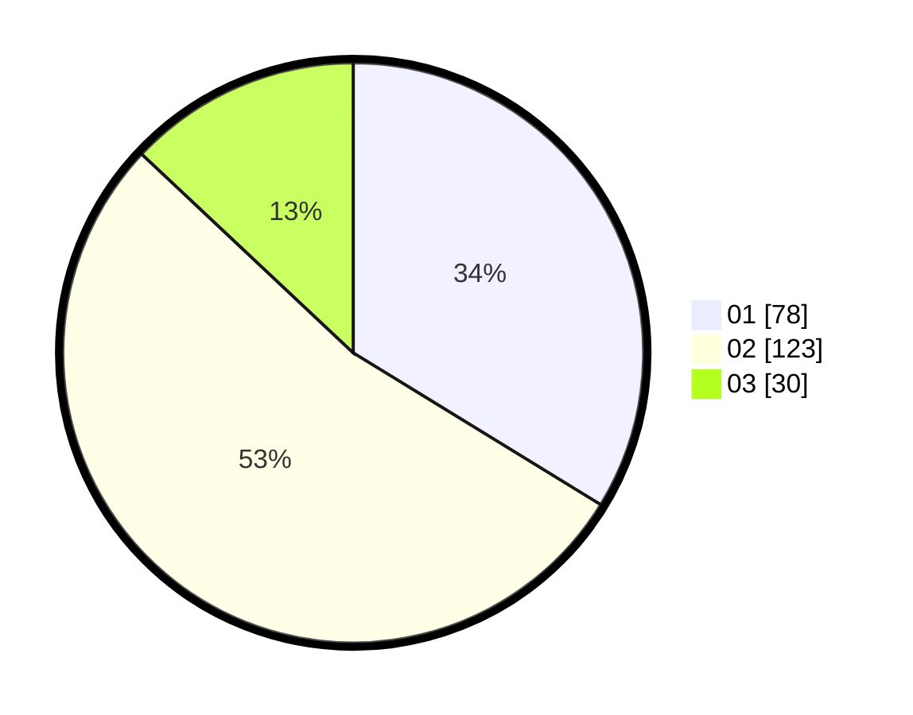

# Hasil

Hasil perolehan suara paslon dapat dilihat pada file paslon-01.txt, paslon-02.txt, dan paslon-03.txt.

Jika tidak ada, artinya data tersebut belum ada pada SIREKAP.

## Perolehan Suara

 * Paslon 01: **78**.
 * Paslon 02: **123**.
 * Paslon 03: **30**.

## Foto C Plano

https://sirekap-obj-formc.kpu.go.id/c9dd/pemilu/ppwp/31/73/06/10/01/3173061001159-20240215-003731--94a8c710-c79a-417c-89ec-c6fd4937f0c9.jpg

https://sirekap-obj-formc.kpu.go.id/c9dd/pemilu/ppwp/31/73/06/10/01/3173061001159-20240215-004558--2dc20768-96a1-4f0e-bcc0-1e39f372e7af.jpg

https://sirekap-obj-formc.kpu.go.id/c9dd/pemilu/ppwp/31/73/06/10/01/3173061001159-20240215-004750--2d4f86f8-50a4-4677-bb80-d88bc88a85a8.jpg

## DATA PEMILIH TETAP

Jumlah pemilih dalam DPT: **299**.
 * L: **142**.
 * P: **157**.

## DATA PENGGUNA HAK PILIH

Jumlah pengguna hak pilih dalam DPT: **224**.
 * L: **105**.
 * P: **119**.

Jumlah pengguna hak pilih dalam DPTb: **8**.
 * L: **1**.
 * P: **7**.

Jumlah pengguna hak pilih dalam DPK: **3**.
 * L: **1**.
 * P: **2**.

Jumlah pengguna hak pilih: **235**.
 * L: **107**.
 * P: **128**.

## JUMLAH SUARA SAH DAN TIDAK SAH

JUMLAH SELURUH SUARA SAH: **231**.

JUMLAH SUARA TIDAK SAH: **4**.

JUMLAH SELURUH SUARA SAH DAN SUARA TIDAK SAH: **235**.
