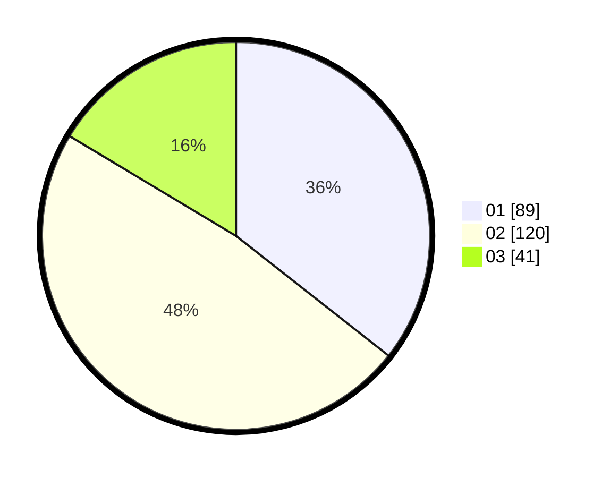

# Hasil

Hasil perolehan suara paslon dapat dilihat pada file paslon-01.txt, paslon-02.txt, dan paslon-03.txt.

Jika tidak ada, artinya data tersebut belum ada pada SIREKAP.

## Perolehan Suara

 * Paslon 01: **89**.
 * Paslon 02: **120**.
 * Paslon 03: **41**.

## Foto C Plano

https://sirekap-obj-formc.kpu.go.id/63cb/pemilu/ppwp/31/73/06/10/01/3173061001161-20240214-221549--82315a7f-2df5-40a0-a72f-4e687d2891ec.jpg

https://sirekap-obj-formc.kpu.go.id/63cb/pemilu/ppwp/31/73/06/10/01/3173061001161-20240214-221514--f9285cd8-1817-4f6a-a97b-67050ee6ff0e.jpg

https://sirekap-obj-formc.kpu.go.id/63cb/pemilu/ppwp/31/73/06/10/01/3173061001161-20240214-221432--0d164895-fd5c-402a-963d-589f2b99f77c.jpg
