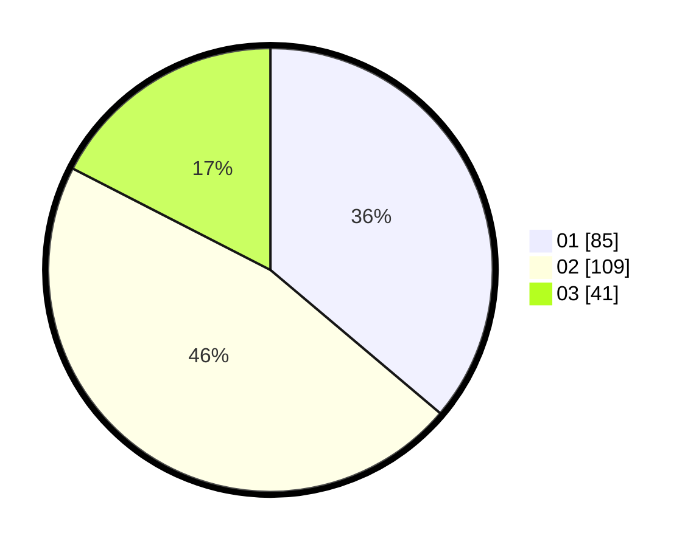

# Hasil

Hasil perolehan suara paslon dapat dilihat pada file paslon-01.txt, paslon-02.txt, dan paslon-03.txt.

Jika tidak ada, artinya data tersebut belum ada pada SIREKAP.

## Perolehan Suara

 * Paslon 01: **85**.
 * Paslon 02: **109**.
 * Paslon 03: **41**.

## Foto C Plano

https://sirekap-obj-formc.kpu.go.id/8039/pemilu/ppwp/31/73/06/10/01/3173061001162-20240214-193059--7577b36f-7d2e-4ec0-b311-05996252eb96.jpg

https://sirekap-obj-formc.kpu.go.id/8039/pemilu/ppwp/31/73/06/10/01/3173061001162-20240214-211045--ff950d99-b18a-4495-9e6c-60cb11744fed.jpg

https://sirekap-obj-formc.kpu.go.id/8039/pemilu/ppwp/31/73/06/10/01/3173061001162-20240214-194144--e4d240b6-0d77-4208-a23c-da8ffc6871b8.jpg

## DATA PEMILIH TETAP

Jumlah pemilih dalam DPT: **298**.
 * L: **142**.
 * P: **156**.

## DATA PENGGUNA HAK PILIH

Jumlah pengguna hak pilih dalam DPT: **226**.
 * L: **105**.
 * P: **121**.

Jumlah pengguna hak pilih dalam DPTb: **5**.
 * L: **4**.
 * P: **1**.

Jumlah pengguna hak pilih dalam DPK: **7**.
 * L: **4**.
 * P: **3**.

Jumlah pengguna hak pilih: **238**.
 * L: **113**.
 * P: **125**.

## JUMLAH SUARA SAH DAN TIDAK SAH

JUMLAH SELURUH SUARA SAH: **235**.

JUMLAH SUARA TIDAK SAH: **3**.

JUMLAH SELURUH SUARA SAH DAN SUARA TIDAK SAH: **238**.
