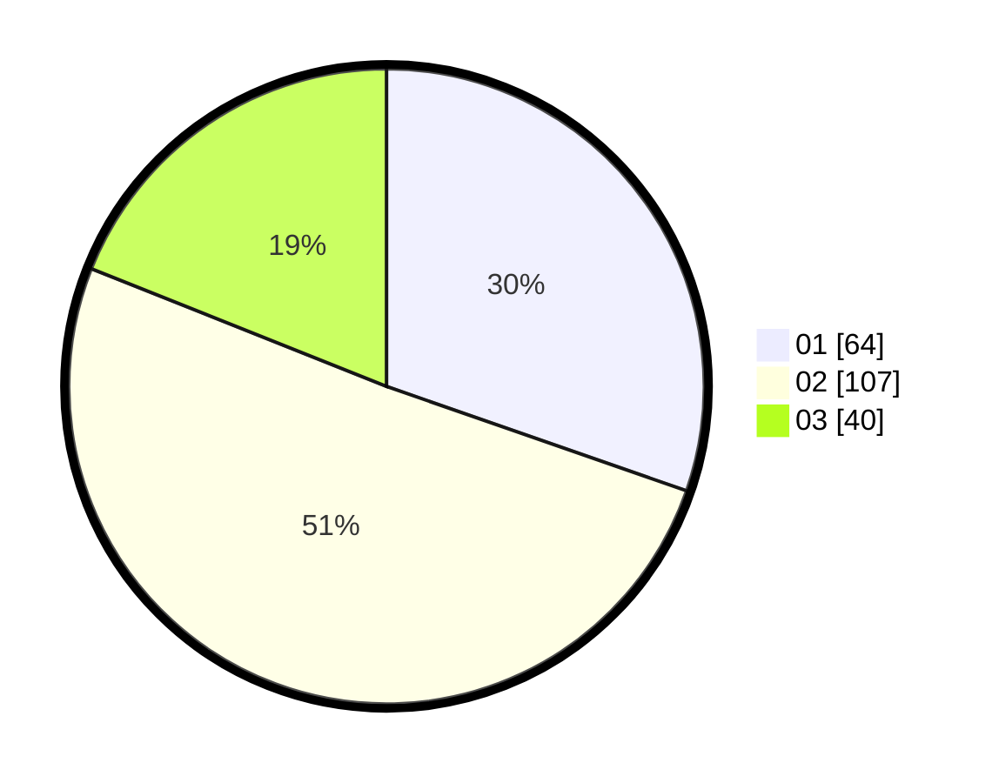

# Hasil

Hasil perolehan suara paslon dapat dilihat pada file paslon-01.txt, paslon-02.txt, dan paslon-03.txt.

Jika tidak ada, artinya data tersebut belum ada pada SIREKAP.

## Perolehan Suara

 * Paslon 01: **64**.
 * Paslon 02: **107**.
 * Paslon 03: **40**.

## Foto C Plano

https://sirekap-obj-formc.kpu.go.id/4787/pemilu/ppwp/31/73/06/10/01/3173061001163-20240216-022545--787a6379-567c-47d9-858d-bdb70346e521.jpg

https://sirekap-obj-formc.kpu.go.id/4787/pemilu/ppwp/31/73/06/10/01/3173061001163-20240216-022546--3bd4194a-9982-4f5b-be20-465fd3189221.jpg

https://sirekap-obj-formc.kpu.go.id/4787/pemilu/ppwp/31/73/06/10/01/3173061001163-20240216-022545--06c7ec90-bd5a-4c1d-ba62-4736b2b4aaa4.jpg

## DATA PEMILIH TETAP

Jumlah pemilih dalam DPT: **295**.
 * L: **156**.
 * P: **139**.

## DATA PENGGUNA HAK PILIH

Jumlah pengguna hak pilih dalam DPT: **210**.
 * L: **106**.
 * P: **104**.

Jumlah pengguna hak pilih dalam DPTb: **3**.
 * L: **2**.
 * P: **1**.

Jumlah pengguna hak pilih dalam DPK: **0**.
 * L: **0**.
 * P: **0**.

Jumlah pengguna hak pilih: **213**.
 * L: **108**.
 * P: **105**.

## JUMLAH SUARA SAH DAN TIDAK SAH

JUMLAH SELURUH SUARA SAH: **211**.

JUMLAH SUARA TIDAK SAH: **2**.

JUMLAH SELURUH SUARA SAH DAN SUARA TIDAK SAH: **213**.
