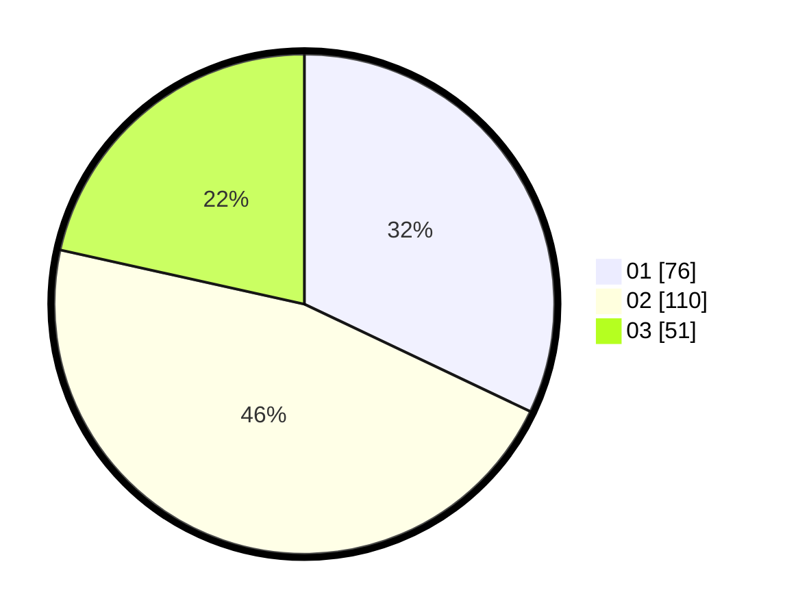

# Hasil

Hasil perolehan suara paslon dapat dilihat pada file paslon-01.txt, paslon-02.txt, dan paslon-03.txt.

Jika tidak ada, artinya data tersebut belum ada pada SIREKAP.

## Perolehan Suara

 * Paslon 01: **76**.
 * Paslon 02: **110**.
 * Paslon 03: **51**.

## Foto C Plano

https://sirekap-obj-formc.kpu.go.id/8368/pemilu/ppwp/31/73/06/10/01/3173061001166-20240215-224010--32d9a55a-7d30-44b0-ad20-ba1634e3c4a8.jpg

https://sirekap-obj-formc.kpu.go.id/8368/pemilu/ppwp/31/73/06/10/01/3173061001166-20240215-224011--60c91c8b-b740-46b4-94d6-f767a4ad6c7e.jpg

https://sirekap-obj-formc.kpu.go.id/8368/pemilu/ppwp/31/73/06/10/01/3173061001166-20240215-224010--f807044f-0ea0-4ae2-81ee-a749058fcb66.jpg

## DATA PEMILIH TETAP

Jumlah pemilih dalam DPT: **298**.
 * L: **136**.
 * P: **162**.

## DATA PENGGUNA HAK PILIH

Jumlah pengguna hak pilih dalam DPT: **227**.
 * L: **102**.
 * P: **125**.

Jumlah pengguna hak pilih dalam DPTb: **16**.
 * L: **2**.
 * P: **14**.

Jumlah pengguna hak pilih dalam DPK: **1**.
 * L: **0**.
 * P: **1**.

Jumlah pengguna hak pilih: **244**.
 * L: **104**.
 * P: **140**.

## JUMLAH SUARA SAH DAN TIDAK SAH

JUMLAH SELURUH SUARA SAH: **237**.

JUMLAH SUARA TIDAK SAH: **7**.

JUMLAH SELURUH SUARA SAH DAN SUARA TIDAK SAH: **244**.
