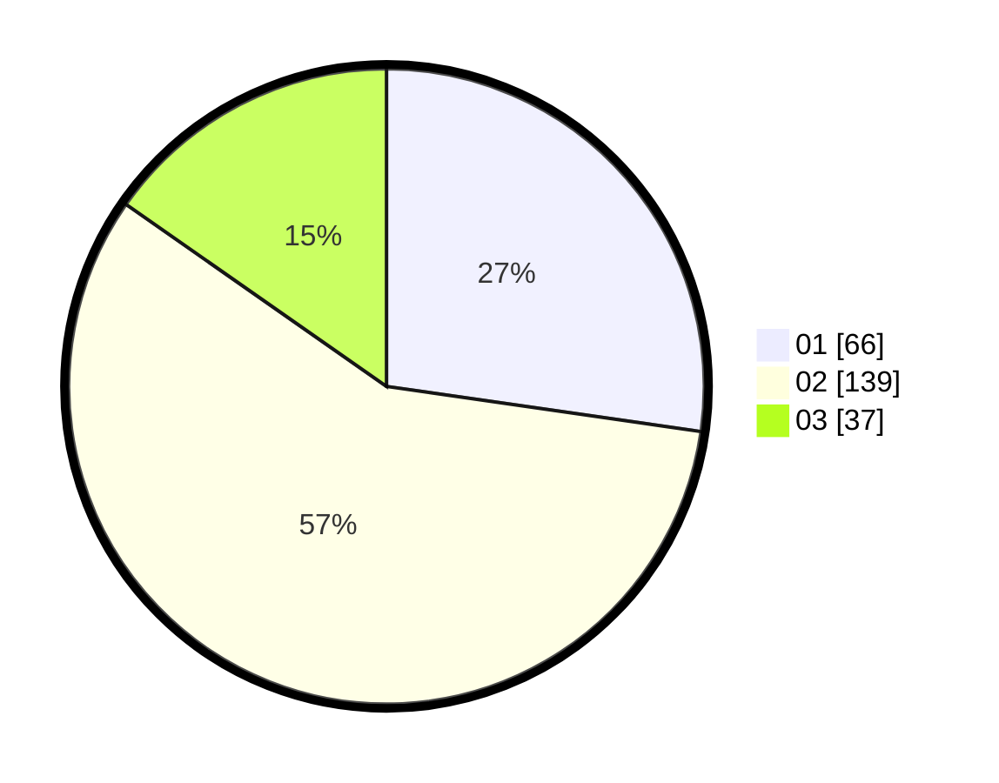

# Hasil

Hasil perolehan suara paslon dapat dilihat pada file paslon-01.txt, paslon-02.txt, dan paslon-03.txt.

Jika tidak ada, artinya data tersebut belum ada pada SIREKAP.

## Perolehan Suara

 * Paslon 01: **66**.
 * Paslon 02: **139**.
 * Paslon 03: **37**.

## Foto C Plano

https://sirekap-obj-formc.kpu.go.id/f124/pemilu/ppwp/31/73/06/10/01/3173061001167-20240215-014740--52a08b4d-9afa-4e61-9f1d-baf3f1c36017.jpg

https://sirekap-obj-formc.kpu.go.id/f124/pemilu/ppwp/31/73/06/10/01/3173061001167-20240215-014839--2fe9d7bb-0ac6-46d6-8466-cc8893d2ff20.jpg

https://sirekap-obj-formc.kpu.go.id/f124/pemilu/ppwp/31/73/06/10/01/3173061001167-20240215-014916--e4279d58-8adb-40ab-952f-5a99c2eb511c.jpg

## DATA PEMILIH TETAP

Jumlah pemilih dalam DPT: **298**.
 * L: **160**.
 * P: **138**.

## DATA PENGGUNA HAK PILIH

Jumlah pengguna hak pilih dalam DPT: **214**.
 * L: **110**.
 * P: **104**.

Jumlah pengguna hak pilih dalam DPTb: **15**.
 * L: **2**.
 * P: **13**.

Jumlah pengguna hak pilih dalam DPK: **16**.
 * L: **6**.
 * P: **10**.

Jumlah pengguna hak pilih: **245**.
 * L: **118**.
 * P: **127**.

## JUMLAH SUARA SAH DAN TIDAK SAH

JUMLAH SELURUH SUARA SAH: **242**.

JUMLAH SUARA TIDAK SAH: **3**.

JUMLAH SELURUH SUARA SAH DAN SUARA TIDAK SAH: **245**.
