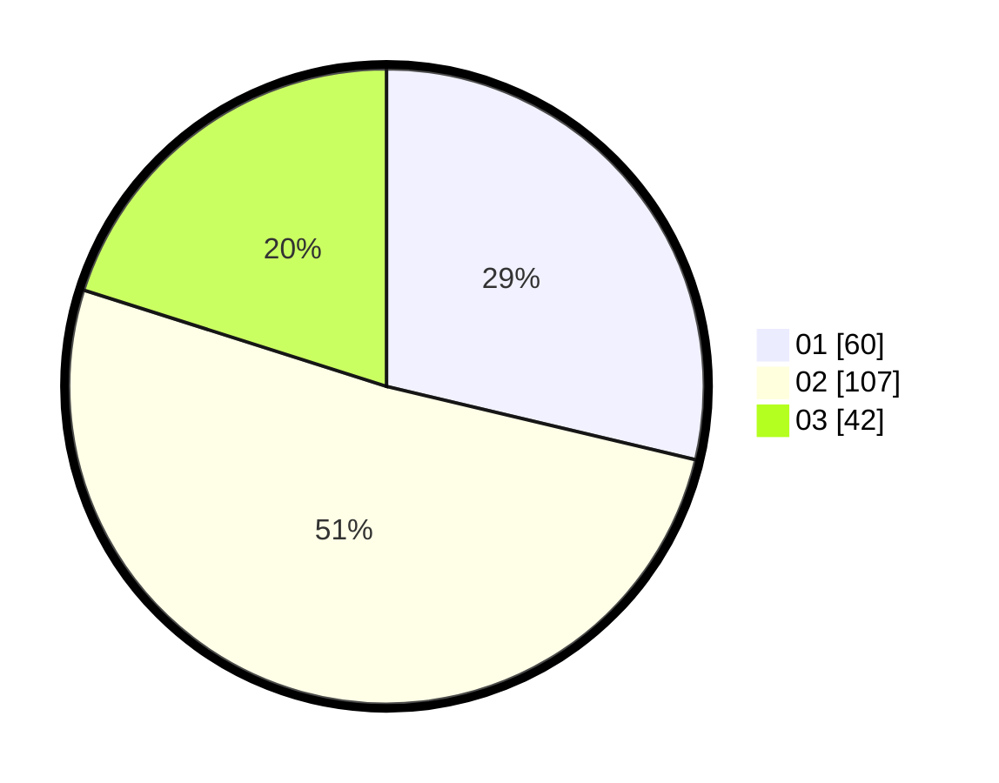

# Hasil

Hasil perolehan suara paslon dapat dilihat pada file paslon-01.txt, paslon-02.txt, dan paslon-03.txt.

Jika tidak ada, artinya data tersebut belum ada pada SIREKAP.

## Perolehan Suara

 * Paslon 01: **60**.
 * Paslon 02: **107**.
 * Paslon 03: **42**.

## Foto C Plano

https://sirekap-obj-formc.kpu.go.id/bbef/pemilu/ppwp/31/73/06/10/01/3173061001168-20240214-225128--38ad5280-0757-4d68-8a4e-745a1ec2815c.jpg

https://sirekap-obj-formc.kpu.go.id/bbef/pemilu/ppwp/31/73/06/10/01/3173061001168-20240214-225517--1a3a231f-5f01-4ffe-9ffe-3e38cce782b8.jpg

https://sirekap-obj-formc.kpu.go.id/bbef/pemilu/ppwp/31/73/06/10/01/3173061001168-20240214-230023--42560de1-a0c1-438a-90d2-df0d9c17a80a.jpg
