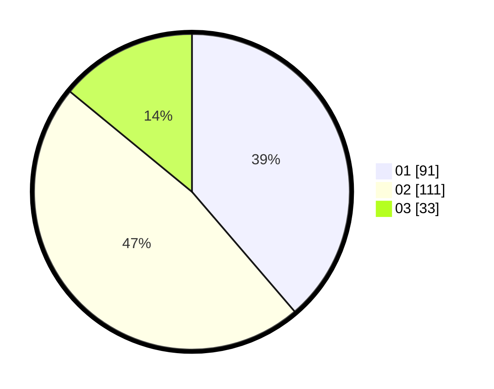

# Hasil

Hasil perolehan suara paslon dapat dilihat pada file paslon-01.txt, paslon-02.txt, dan paslon-03.txt.

Jika tidak ada, artinya data tersebut belum ada pada SIREKAP.

## Perolehan Suara

 * Paslon 01: **91**.
 * Paslon 02: **111**.
 * Paslon 03: **33**.

## Foto C Plano

https://sirekap-obj-formc.kpu.go.id/e0cc/pemilu/ppwp/31/73/06/10/01/3173061001170-20240216-123049--547849fa-b5f5-43dd-901c-81b8bb56709a.jpg

https://sirekap-obj-formc.kpu.go.id/e0cc/pemilu/ppwp/31/73/06/10/01/3173061001170-20240216-123055--0869cf2f-5449-4c8b-ac79-3142b5ef6d7a.jpg

https://sirekap-obj-formc.kpu.go.id/e0cc/pemilu/ppwp/31/73/06/10/01/3173061001170-20240216-123054--1c59da83-02e1-4ccc-af3e-6f738390bdbb.jpg

## DATA PEMILIH TETAP

Jumlah pemilih dalam DPT: **235**.
 * L: **112**.
 * P: **123**.

## DATA PENGGUNA HAK PILIH

Jumlah pengguna hak pilih dalam DPT: **235**.
 * L: **112**.
 * P: **123**.

Jumlah pengguna hak pilih dalam DPTb: **1**.
 * L: **1**.
 * P: **0**.

Jumlah pengguna hak pilih dalam DPK: **2**.
 * L: **1**.
 * P: **1**.

Jumlah pengguna hak pilih: **238**.
 * L: **114**.
 * P: **124**.

## JUMLAH SUARA SAH DAN TIDAK SAH

JUMLAH SELURUH SUARA SAH: **235**.

JUMLAH SUARA TIDAK SAH: **3**.

JUMLAH SELURUH SUARA SAH DAN SUARA TIDAK SAH: **238**.
