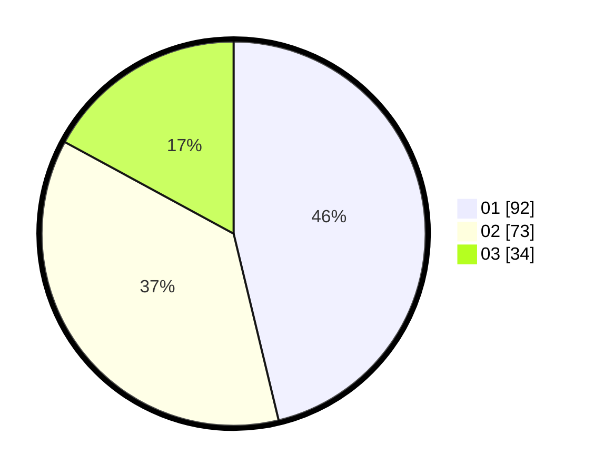

# Hasil

Hasil perolehan suara paslon dapat dilihat pada file paslon-01.txt, paslon-02.txt, dan paslon-03.txt.

Jika tidak ada, artinya data tersebut belum ada pada SIREKAP.

## Perolehan Suara

 * Paslon 01: **92**.
 * Paslon 02: **73**.
 * Paslon 03: **34**.

## Foto C Plano

https://sirekap-obj-formc.kpu.go.id/7de4/pemilu/ppwp/31/73/06/10/01/3173061001176-20240214-210000--84b8762f-117a-43e8-ad90-d4776cb27140.jpg

https://sirekap-obj-formc.kpu.go.id/7de4/pemilu/ppwp/31/73/06/10/01/3173061001176-20240214-210134--494da29a-84c1-4e38-bf48-20b07ac20f83.jpg

https://sirekap-obj-formc.kpu.go.id/7de4/pemilu/ppwp/31/73/06/10/01/3173061001176-20240214-210249--2c9e8c38-8b73-4cc2-9599-cba962c26f93.jpg
