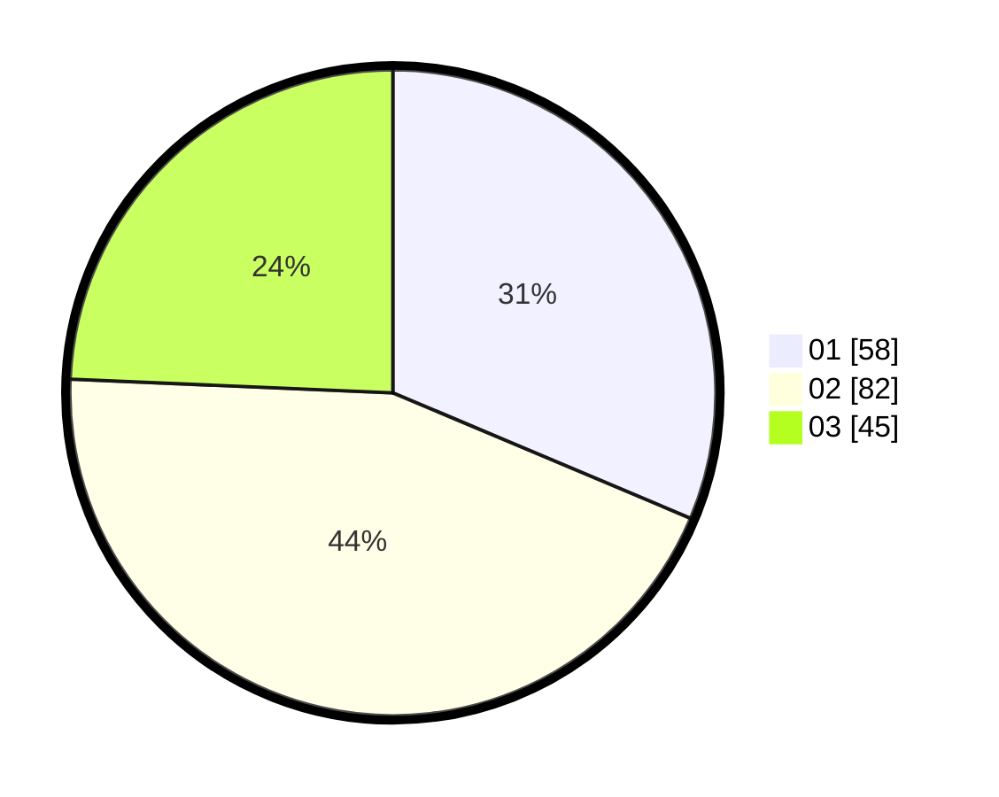

# Hasil

Hasil perolehan suara paslon dapat dilihat pada file paslon-01.txt, paslon-02.txt, dan paslon-03.txt.

Jika tidak ada, artinya data tersebut belum ada pada SIREKAP.

## Perolehan Suara

 * Paslon 01: **58**.
 * Paslon 02: **82**.
 * Paslon 03: **45**.

## Foto C Plano

https://sirekap-obj-formc.kpu.go.id/e883/pemilu/ppwp/31/73/06/10/01/3173061001178-20240214-220832--634ffc8c-6e4e-4032-99d1-19fbf178d267.jpg

https://sirekap-obj-formc.kpu.go.id/e883/pemilu/ppwp/31/73/06/10/01/3173061001178-20240214-220934--0a40baa4-c767-444f-b2b7-ef561629ab71.jpg

https://sirekap-obj-formc.kpu.go.id/e883/pemilu/ppwp/31/73/06/10/01/3173061001178-20240214-221050--e864a56a-00ab-40a7-9234-f31601e7f20e.jpg
