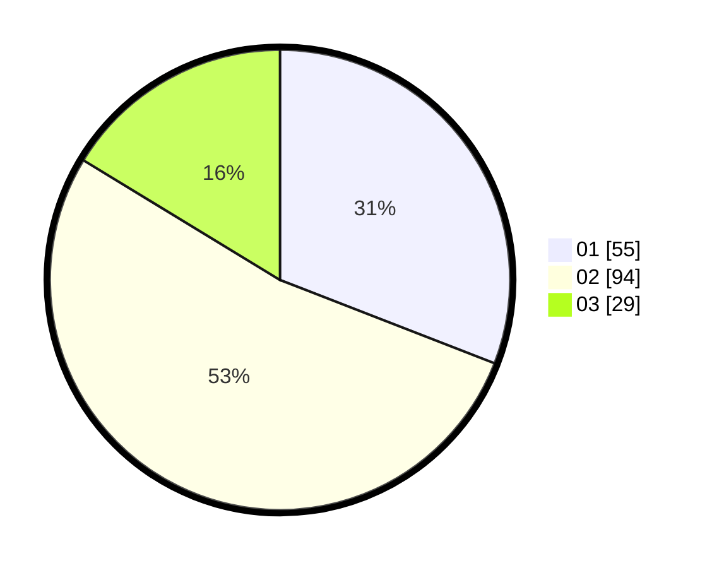

# Hasil

Hasil perolehan suara paslon dapat dilihat pada file paslon-01.txt, paslon-02.txt, dan paslon-03.txt.

Jika tidak ada, artinya data tersebut belum ada pada SIREKAP.

## Perolehan Suara

 * Paslon 01: **55**.
 * Paslon 02: **94**.
 * Paslon 03: **29**.

## Foto C Plano

https://sirekap-obj-formc.kpu.go.id/a034/pemilu/ppwp/31/73/06/10/01/3173061001179-20240214-225233--c0eb3fd7-c437-47c9-b3af-ddaf13f0e5f2.jpg

https://sirekap-obj-formc.kpu.go.id/a034/pemilu/ppwp/31/73/06/10/01/3173061001179-20240214-225350--54d53244-4d95-416e-b885-40a42650a0f3.jpg

https://sirekap-obj-formc.kpu.go.id/a034/pemilu/ppwp/31/73/06/10/01/3173061001179-20240214-225539--05686573-e37d-4cdf-8023-1e44f5d5b8e1.jpg
