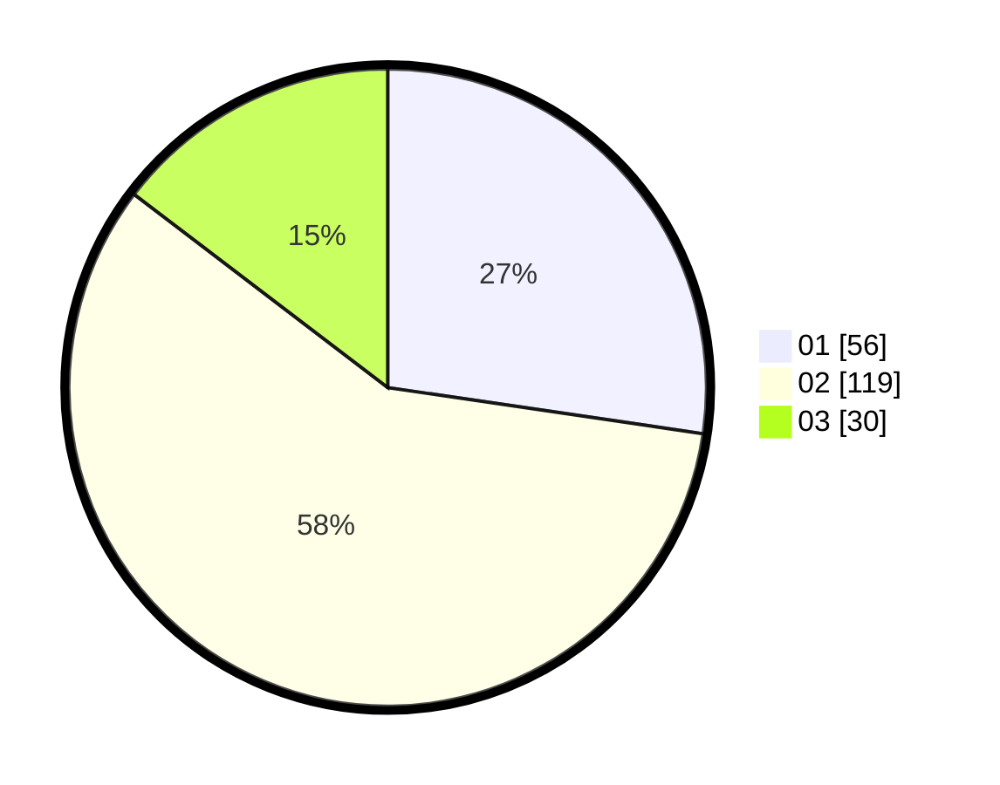

# Hasil

Hasil perolehan suara paslon dapat dilihat pada file paslon-01.txt, paslon-02.txt, dan paslon-03.txt.

Jika tidak ada, artinya data tersebut belum ada pada SIREKAP.

## Perolehan Suara

 * Paslon 01: **56**.
 * Paslon 02: **119**.
 * Paslon 03: **30**.

## Foto C Plano

https://sirekap-obj-formc.kpu.go.id/1e86/pemilu/ppwp/31/73/06/10/01/3173061001189-20240216-010820--2667760b-d4ac-4fd1-b34b-06a515bf65b5.jpg

https://sirekap-obj-formc.kpu.go.id/1e86/pemilu/ppwp/31/73/06/10/01/3173061001189-20240216-010829--0dabeaa5-17a4-4146-b81e-b122e76a947b.jpg

https://sirekap-obj-formc.kpu.go.id/1e86/pemilu/ppwp/31/73/06/10/01/3173061001189-20240216-010827--e32dfac6-d5b6-4e4f-af1a-d7d1b429d82a.jpg

## DATA PEMILIH TETAP

Jumlah pemilih dalam DPT: **287**.
 * L: **150**.
 * P: **137**.

## DATA PENGGUNA HAK PILIH

Jumlah pengguna hak pilih dalam DPT: **287**.
 * L: **150**.
 * P: **137**.

Jumlah pengguna hak pilih dalam DPTb: **1**.
 * L: **0**.
 * P: **1**.

Jumlah pengguna hak pilih dalam DPK: **2**.
 * L: **1**.
 * P: **1**.

Jumlah pengguna hak pilih: **290**.
 * L: **151**.
 * P: **139**.

## JUMLAH SUARA SAH DAN TIDAK SAH

JUMLAH SELURUH SUARA SAH: **205**.

JUMLAH SUARA TIDAK SAH: **0**.

JUMLAH SELURUH SUARA SAH DAN SUARA TIDAK SAH: **205**.
