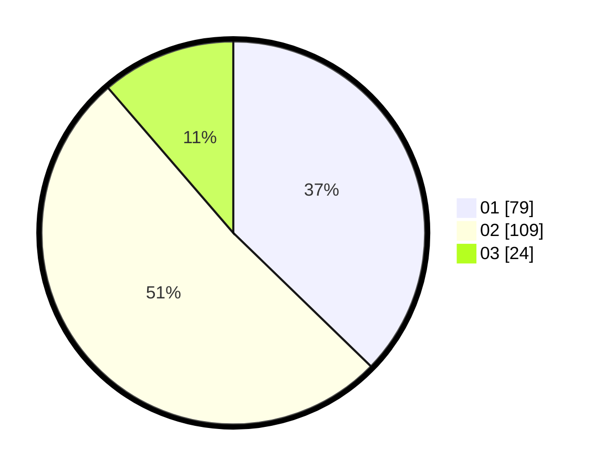

# Hasil

Hasil perolehan suara paslon dapat dilihat pada file paslon-01.txt, paslon-02.txt, dan paslon-03.txt.

Jika tidak ada, artinya data tersebut belum ada pada SIREKAP.

## Perolehan Suara

 * Paslon 01: **79**.
 * Paslon 02: **109**.
 * Paslon 03: **24**.

## Foto C Plano

https://sirekap-obj-formc.kpu.go.id/e6b8/pemilu/ppwp/31/73/06/10/01/3173061001194-20240216-155055--94940bd4-a801-4c5a-bf60-283886aed856.jpg

https://sirekap-obj-formc.kpu.go.id/e6b8/pemilu/ppwp/31/73/06/10/01/3173061001194-20240216-155057--837ce176-2f9d-4634-9dcd-1fd7171922b7.jpg

https://sirekap-obj-formc.kpu.go.id/e6b8/pemilu/ppwp/31/73/06/10/01/3173061001194-20240216-155056--7527465d-04f4-411e-9740-6b6dbce91438.jpg

## DATA PEMILIH TETAP

Jumlah pemilih dalam DPT: **295**.
 * L: **144**.
 * P: **151**.

## DATA PENGGUNA HAK PILIH

Jumlah pengguna hak pilih dalam DPT: **295**.
 * L: **144**.
 * P: **151**.

Jumlah pengguna hak pilih dalam DPTb: **0**.
 * L: **1**.
 * P: **0**.

Jumlah pengguna hak pilih dalam DPK: **0**.
 * L: **1**.
 * P: **1**.

Jumlah pengguna hak pilih: **298**.
 * L: **146**.
 * P: **152**.

## JUMLAH SUARA SAH DAN TIDAK SAH

JUMLAH SELURUH SUARA SAH: **212**.

JUMLAH SUARA TIDAK SAH: **1**.

JUMLAH SELURUH SUARA SAH DAN SUARA TIDAK SAH: **213**.
