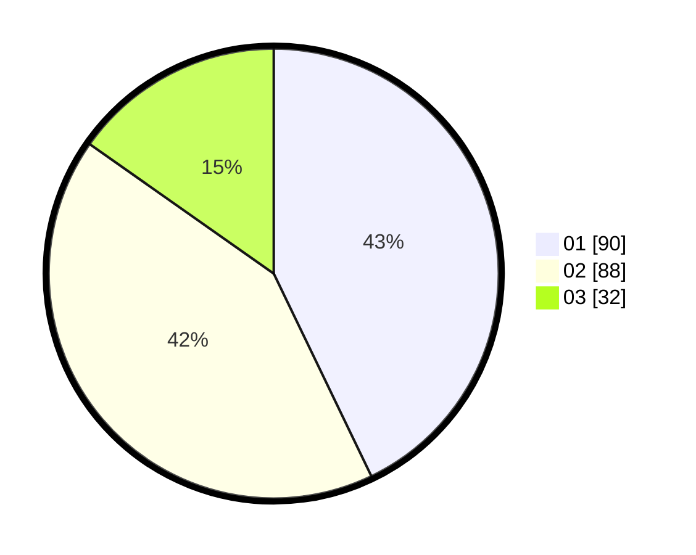

# Hasil

Hasil perolehan suara paslon dapat dilihat pada file paslon-01.txt, paslon-02.txt, dan paslon-03.txt.

Jika tidak ada, artinya data tersebut belum ada pada SIREKAP.

## Perolehan Suara

 * Paslon 01: **90**.
 * Paslon 02: **88**.
 * Paslon 03: **32**.

## Foto C Plano

https://sirekap-obj-formc.kpu.go.id/406e/pemilu/ppwp/31/73/06/10/01/3173061001197-20240214-155219--dd46d28f-b210-4c15-a725-eb22500edeab.jpg

https://sirekap-obj-formc.kpu.go.id/406e/pemilu/ppwp/31/73/06/10/01/3173061001197-20240214-141831--00ece467-0efe-49de-8835-c2870de1d615.jpg

https://sirekap-obj-formc.kpu.go.id/406e/pemilu/ppwp/31/73/06/10/01/3173061001197-20240214-155118--1551372f-d4f0-4812-8e2f-08063bdd38c2.jpg

## DATA PEMILIH TETAP

Jumlah pemilih dalam DPT: **294**.
 * L: **148**.
 * P: **146**.

## DATA PENGGUNA HAK PILIH

Jumlah pengguna hak pilih dalam DPT: **213**.
 * L: **104**.
 * P: **109**.

Jumlah pengguna hak pilih dalam DPTb: **0**.
 * L: **0**.
 * P: **0**.

Jumlah pengguna hak pilih dalam DPK: **0**.
 * L: **0**.
 * P: **0**.

Jumlah pengguna hak pilih: **213**.
 * L: **104**.
 * P: **109**.

## JUMLAH SUARA SAH DAN TIDAK SAH

JUMLAH SELURUH SUARA SAH: **210**.

JUMLAH SUARA TIDAK SAH: **3**.

JUMLAH SELURUH SUARA SAH DAN SUARA TIDAK SAH: **213**.
