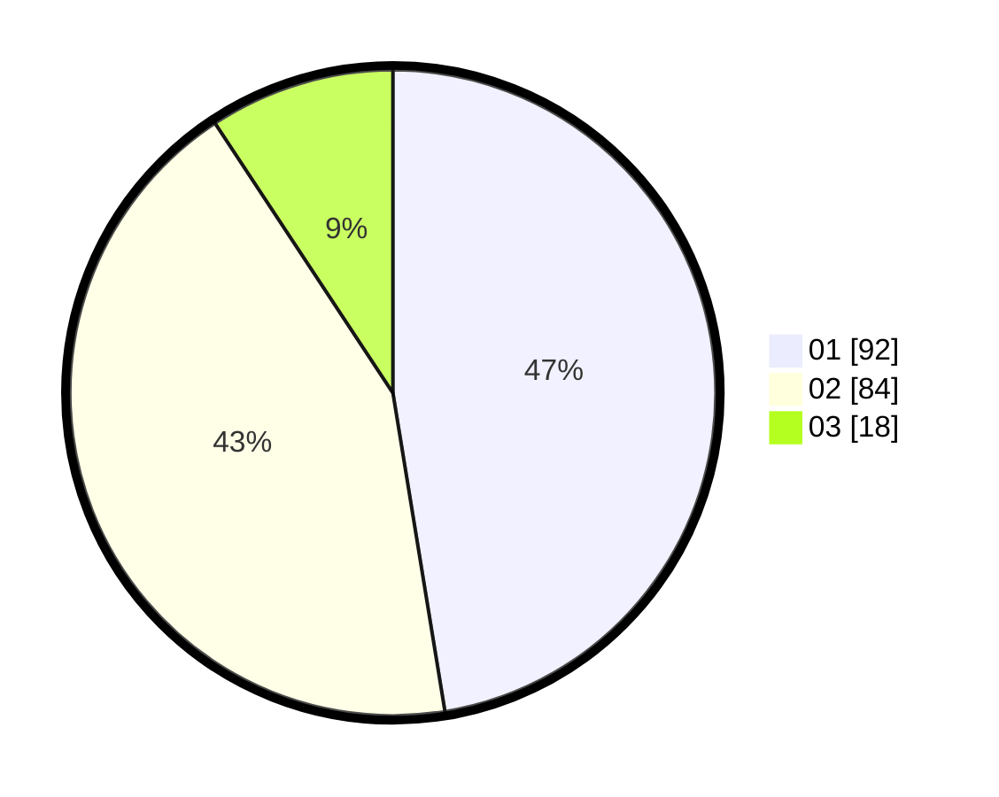

# Hasil

Hasil perolehan suara paslon dapat dilihat pada file paslon-01.txt, paslon-02.txt, dan paslon-03.txt.

Jika tidak ada, artinya data tersebut belum ada pada SIREKAP.

## Perolehan Suara

 * Paslon 01: **92**.
 * Paslon 02: **84**.
 * Paslon 03: **18**.

## Foto C Plano

https://sirekap-obj-formc.kpu.go.id/a56a/pemilu/ppwp/31/73/06/10/01/3173061001205-20240216-005947--08f331fb-644a-43a9-be6a-6660c2111df6.jpg

https://sirekap-obj-formc.kpu.go.id/a56a/pemilu/ppwp/31/73/06/10/01/3173061001205-20240216-010914--502ef9ce-3bc3-420e-a013-874272fb0126.jpg

https://sirekap-obj-formc.kpu.go.id/a56a/pemilu/ppwp/31/73/06/10/01/3173061001205-20240216-005948--55589306-0f5f-42fd-841f-05d82dad1224.jpg

## DATA PEMILIH TETAP

Jumlah pemilih dalam DPT: **251**.
 * L: **128**.
 * P: **123**.

## DATA PENGGUNA HAK PILIH

Jumlah pengguna hak pilih dalam DPT: **195**.
 * L: **100**.
 * P: **95**.

Jumlah pengguna hak pilih dalam DPTb: **0**.
 * L: **0**.
 * P: **0**.

Jumlah pengguna hak pilih dalam DPK: **0**.
 * L: **0**.
 * P: **0**.

Jumlah pengguna hak pilih: **195**.
 * L: **100**.
 * P: **95**.

## JUMLAH SUARA SAH DAN TIDAK SAH

JUMLAH SELURUH SUARA SAH: **194**.

JUMLAH SUARA TIDAK SAH: **1**.

JUMLAH SELURUH SUARA SAH DAN SUARA TIDAK SAH: **195**.
