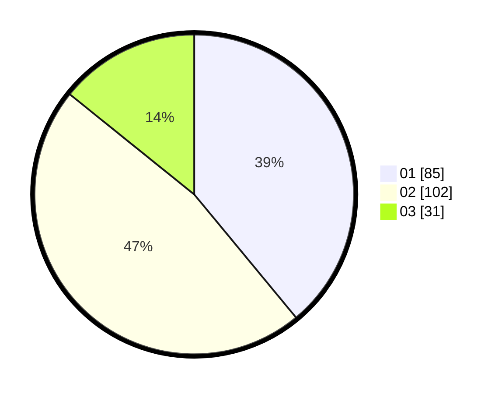

# Hasil

Hasil perolehan suara paslon dapat dilihat pada file paslon-01.txt, paslon-02.txt, dan paslon-03.txt.

Jika tidak ada, artinya data tersebut belum ada pada SIREKAP.

## Perolehan Suara

 * Paslon 01: **85**.
 * Paslon 02: **102**.
 * Paslon 03: **31**.

## Foto C Plano

https://sirekap-obj-formc.kpu.go.id/8f2a/pemilu/ppwp/31/73/06/10/01/3173061001210-20240214-215732--d130afea-c47a-4268-8e00-fc19b96d7f5c.jpg

https://sirekap-obj-formc.kpu.go.id/8f2a/pemilu/ppwp/31/73/06/10/01/3173061001210-20240214-224154--7f9b9ffa-6d8e-4357-b767-07a2cb8995a4.jpg

https://sirekap-obj-formc.kpu.go.id/8f2a/pemilu/ppwp/31/73/06/10/01/3173061001210-20240214-224105--572d6ba0-badc-47e9-abec-4fb1d54655b0.jpg
