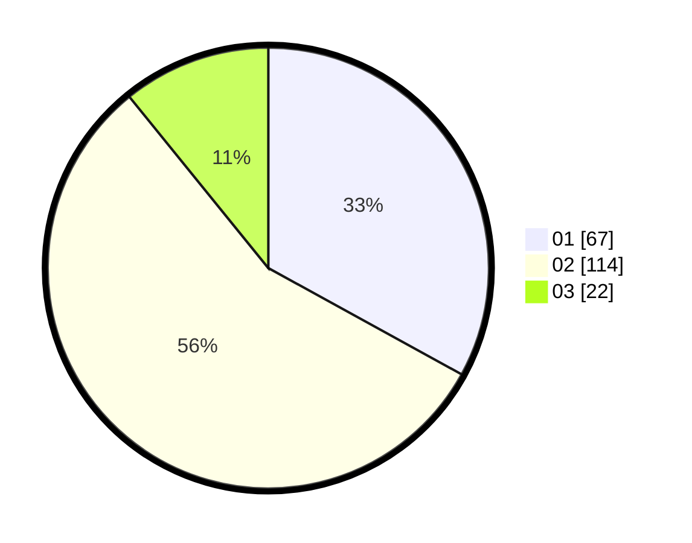

# Hasil

Hasil perolehan suara paslon dapat dilihat pada file paslon-01.txt, paslon-02.txt, dan paslon-03.txt.

Jika tidak ada, artinya data tersebut belum ada pada SIREKAP.

## Perolehan Suara

 * Paslon 01: **67**.
 * Paslon 02: **114**.
 * Paslon 03: **22**.

## Foto C Plano

https://sirekap-obj-formc.kpu.go.id/1bf4/pemilu/ppwp/31/73/06/10/01/3173061001214-20240215-011235--14428539-4c21-4e41-a2c6-7e05a114fb8b.jpg

https://sirekap-obj-formc.kpu.go.id/1bf4/pemilu/ppwp/31/73/06/10/01/3173061001214-20240215-011414--763b22b0-cd19-4657-8a2c-02f63e5ec336.jpg

https://sirekap-obj-formc.kpu.go.id/1bf4/pemilu/ppwp/31/73/06/10/01/3173061001214-20240215-011719--addc15fd-2970-4407-a4b2-7798ed32df52.jpg
