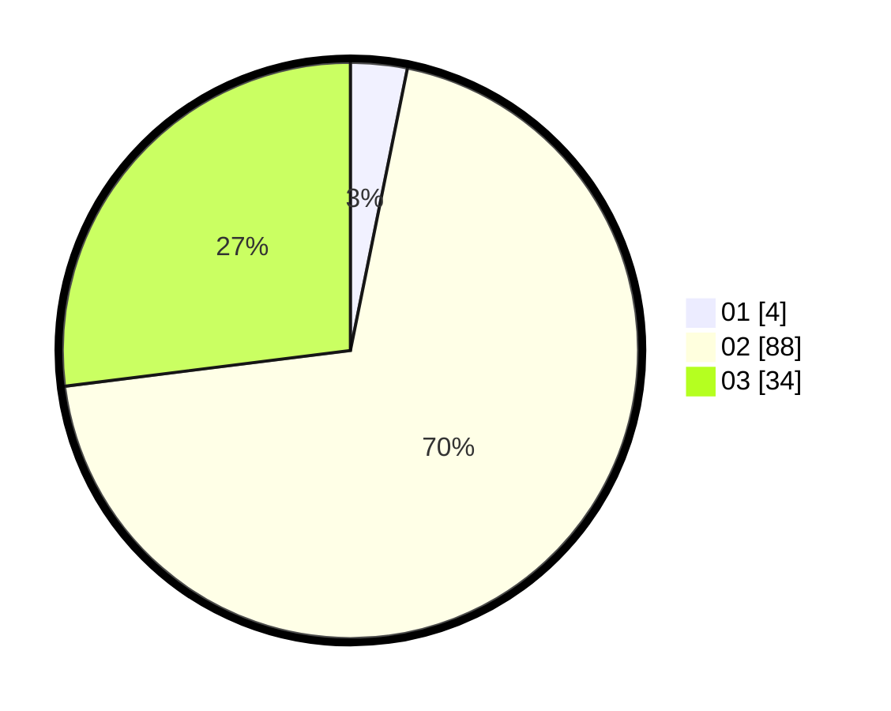

# Hasil

Hasil perolehan suara paslon dapat dilihat pada file paslon-01.txt, paslon-02.txt, dan paslon-03.txt.

Jika tidak ada, artinya data tersebut belum ada pada SIREKAP.

## Perolehan Suara

 * Paslon 01: **4**.
 * Paslon 02: **88**.
 * Paslon 03: **34**.

## Foto C Plano

https://sirekap-obj-formc.kpu.go.id/c76e/pemilu/ppwp/31/73/06/10/01/3173061001216-20240214-194041--9394f3c1-67bc-4fad-a549-22993accf1bb.jpg

https://sirekap-obj-formc.kpu.go.id/c76e/pemilu/ppwp/31/73/06/10/01/3173061001216-20240214-222137--114ada83-0e08-41d4-af73-f6cab4260e6a.jpg

https://sirekap-obj-formc.kpu.go.id/c76e/pemilu/ppwp/31/73/06/10/01/3173061001216-20240214-195444--fb5c9a37-1f1f-460f-b340-ba82567ea2c6.jpg

## DATA PEMILIH TETAP

Jumlah pemilih dalam DPT: **228**.
 * L: **119**.
 * P: **109**.

## DATA PENGGUNA HAK PILIH

Jumlah pengguna hak pilih dalam DPT: **187**.
 * L: **95**.
 * P: **92**.

Jumlah pengguna hak pilih dalam DPTb: **0**.
 * L: **0**.
 * P: **0**.

Jumlah pengguna hak pilih dalam DPK: **1**.
 * L: **1**.
 * P: **0**.

Jumlah pengguna hak pilih: **188**.
 * L: **96**.
 * P: **92**.

## JUMLAH SUARA SAH DAN TIDAK SAH

JUMLAH SELURUH SUARA SAH: **186**.

JUMLAH SUARA TIDAK SAH: **2**.

JUMLAH SELURUH SUARA SAH DAN SUARA TIDAK SAH: **188**.
