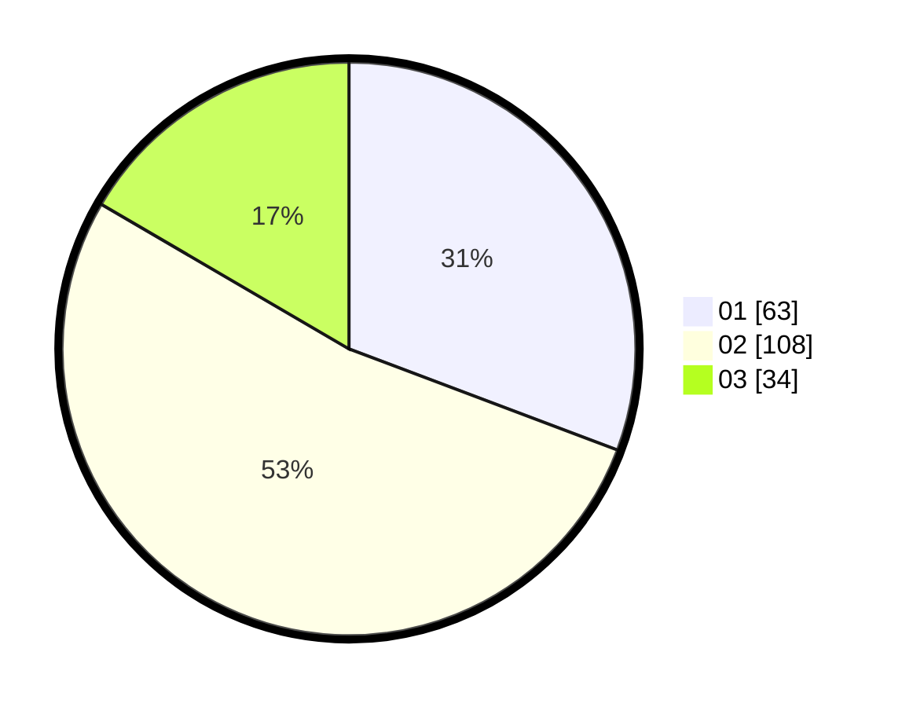

# Hasil

Hasil perolehan suara paslon dapat dilihat pada file paslon-01.txt, paslon-02.txt, dan paslon-03.txt.

Jika tidak ada, artinya data tersebut belum ada pada SIREKAP.

## Perolehan Suara

 * Paslon 01: **63**.
 * Paslon 02: **108**.
 * Paslon 03: **34**.

## Foto C Plano

https://sirekap-obj-formc.kpu.go.id/e864/pemilu/ppwp/31/73/06/10/01/3173061001217-20240215-133335--0b94069f-b862-464d-a0ac-6d3003803eee.jpg

https://sirekap-obj-formc.kpu.go.id/e864/pemilu/ppwp/31/73/06/10/01/3173061001217-20240215-133356--d13ddfe7-7326-4c07-b35e-6a55bdb11890.jpg

https://sirekap-obj-formc.kpu.go.id/e864/pemilu/ppwp/31/73/06/10/01/3173061001217-20240215-133346--a1186660-7add-495d-b54f-231008e20f14.jpg

## DATA PEMILIH TETAP

Jumlah pemilih dalam DPT: **206**.
 * L: **100**.
 * P: **106**.

## DATA PENGGUNA HAK PILIH

Jumlah pengguna hak pilih dalam DPT: **270**.
 * L: **130**.
 * P: **140**.

Jumlah pengguna hak pilih dalam DPTb: **0**.
 * L: **0**.
 * P: **0**.

Jumlah pengguna hak pilih dalam DPK: **1**.
 * L: **1**.
 * P: **0**.

Jumlah pengguna hak pilih: **0**.
 * L: **0**.
 * P: **0**.

## JUMLAH SUARA SAH DAN TIDAK SAH

JUMLAH SELURUH SUARA SAH: **205**.

JUMLAH SUARA TIDAK SAH: **2**.

JUMLAH SELURUH SUARA SAH DAN SUARA TIDAK SAH: **207**.
