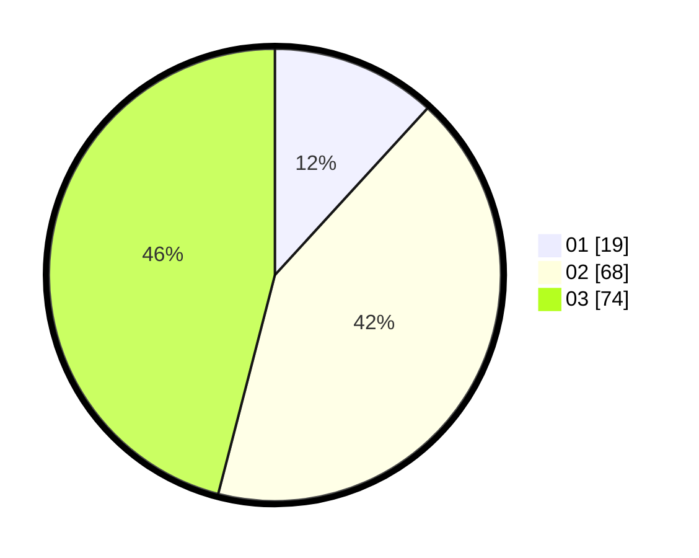

# Hasil

Hasil perolehan suara paslon dapat dilihat pada file paslon-01.txt, paslon-02.txt, dan paslon-03.txt.

Jika tidak ada, artinya data tersebut belum ada pada SIREKAP.

## Perolehan Suara

 * Paslon 01: **19**.
 * Paslon 02: **68**.
 * Paslon 03: **74**.

## Foto C Plano

https://sirekap-obj-formc.kpu.go.id/d465/pemilu/ppwp/31/73/06/10/01/3173061001226-20240214-221124--c29ce56d-66b7-407b-9d57-bca418e4a56e.jpg

https://sirekap-obj-formc.kpu.go.id/d465/pemilu/ppwp/31/73/06/10/01/3173061001226-20240214-221404--0cacfd3e-d85e-4884-8ec6-f0f7e764780a.jpg

https://sirekap-obj-formc.kpu.go.id/d465/pemilu/ppwp/31/73/06/10/01/3173061001226-20240214-221531--c6e7b212-b2c5-4655-8583-d686d56a73ad.jpg
