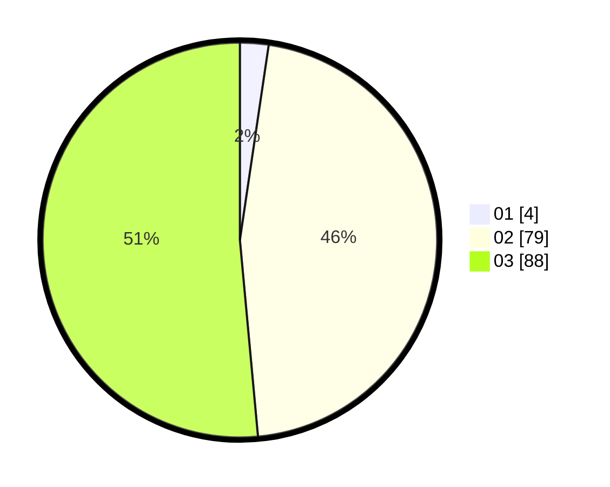

# Hasil

Hasil perolehan suara paslon dapat dilihat pada file paslon-01.txt, paslon-02.txt, dan paslon-03.txt.

Jika tidak ada, artinya data tersebut belum ada pada SIREKAP.

## Perolehan Suara

 * Paslon 01: **4**.
 * Paslon 02: **79**.
 * Paslon 03: **88**.

## Foto C Plano

https://sirekap-obj-formc.kpu.go.id/3905/pemilu/ppwp/31/73/06/10/01/3173061001227-20240214-190002--89fb9dfa-5403-44c3-81d2-a9feed4b3f74.jpg

https://sirekap-obj-formc.kpu.go.id/3905/pemilu/ppwp/31/73/06/10/01/3173061001227-20240214-192616--0e081f8e-1709-4b9c-985e-769502bd7389.jpg

https://sirekap-obj-formc.kpu.go.id/3905/pemilu/ppwp/31/73/06/10/01/3173061001227-20240214-190137--39b0297f-72b5-43dc-8a72-af86e8061532.jpg

## DATA PEMILIH TETAP

Jumlah pemilih dalam DPT: **218**.
 * L: **100**.
 * P: **118**.

## DATA PENGGUNA HAK PILIH

Jumlah pengguna hak pilih dalam DPT: **167**.
 * L: **76**.
 * P: **91**.

Jumlah pengguna hak pilih dalam DPTb: **3**.
 * L: **0**.
 * P: **3**.

Jumlah pengguna hak pilih dalam DPK: **3**.
 * L: **1**.
 * P: **2**.

Jumlah pengguna hak pilih: **173**.
 * L: **77**.
 * P: **96**.

## JUMLAH SUARA SAH DAN TIDAK SAH

JUMLAH SELURUH SUARA SAH: **171**.

JUMLAH SUARA TIDAK SAH: **2**.

JUMLAH SELURUH SUARA SAH DAN SUARA TIDAK SAH: **173**.
