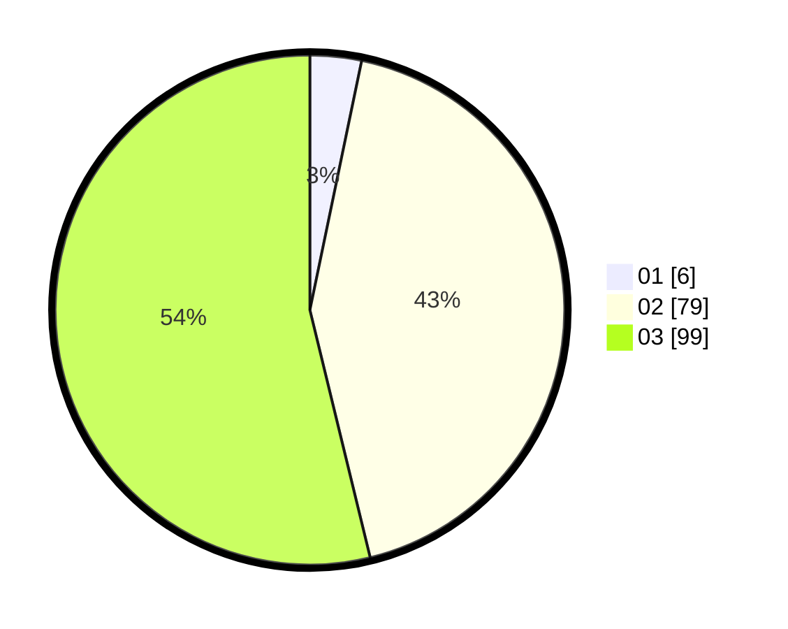

# Hasil

Hasil perolehan suara paslon dapat dilihat pada file paslon-01.txt, paslon-02.txt, dan paslon-03.txt.

Jika tidak ada, artinya data tersebut belum ada pada SIREKAP.

## Perolehan Suara

 * Paslon 01: **6**.
 * Paslon 02: **79**.
 * Paslon 03: **99**.

## Foto C Plano

https://sirekap-obj-formc.kpu.go.id/c028/pemilu/ppwp/31/73/06/10/01/3173061001230-20240215-132101--2956bce8-e8f7-4b81-a830-77dd86e55516.jpg

https://sirekap-obj-formc.kpu.go.id/c028/pemilu/ppwp/31/73/06/10/01/3173061001230-20240215-132123--d92c85c0-a216-4e65-be17-5128d8cd7e31.jpg

https://sirekap-obj-formc.kpu.go.id/c028/pemilu/ppwp/31/73/06/10/01/3173061001230-20240215-132112--7a4eeb3d-205f-4a3f-8157-5718fad59f90.jpg

## DATA PEMILIH TETAP

Jumlah pemilih dalam DPT: **236**.
 * L: **118**.
 * P: **118**.

## DATA PENGGUNA HAK PILIH

Jumlah pengguna hak pilih dalam DPT: **175**.
 * L: **85**.
 * P: **90**.

Jumlah pengguna hak pilih dalam DPTb: **6**.
 * L: **1**.
 * P: **5**.

Jumlah pengguna hak pilih dalam DPK: **5**.
 * L: **3**.
 * P: **2**.

Jumlah pengguna hak pilih: **186**.
 * L: **89**.
 * P: **97**.

## JUMLAH SUARA SAH DAN TIDAK SAH

JUMLAH SELURUH SUARA SAH: **184**.

JUMLAH SUARA TIDAK SAH: **2**.

JUMLAH SELURUH SUARA SAH DAN SUARA TIDAK SAH: **186**.
