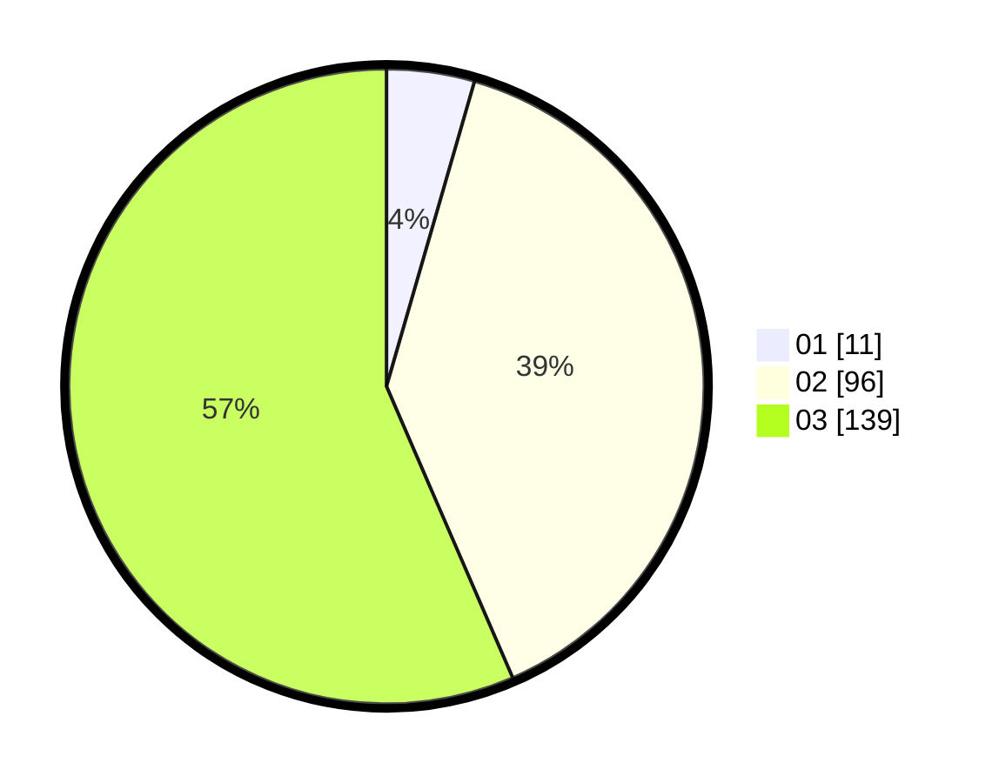

# Hasil

Hasil perolehan suara paslon dapat dilihat pada file paslon-01.txt, paslon-02.txt, dan paslon-03.txt.

Jika tidak ada, artinya data tersebut belum ada pada SIREKAP.

## Perolehan Suara

 * Paslon 01: **11**.
 * Paslon 02: **96**.
 * Paslon 03: **139**.

## Foto C Plano

https://sirekap-obj-formc.kpu.go.id/b674/pemilu/ppwp/31/73/06/10/01/3173061001232-20240214-184806--237962e8-da0a-4bbd-922e-4a5d186e862b.jpg

https://sirekap-obj-formc.kpu.go.id/b674/pemilu/ppwp/31/73/06/10/01/3173061001232-20240214-185030--13d58f01-c043-4786-81fc-4a08e7a165c9.jpg

https://sirekap-obj-formc.kpu.go.id/b674/pemilu/ppwp/31/73/06/10/01/3173061001232-20240214-185411--9a791116-097d-423c-b324-ac968225b8d4.jpg

## DATA PEMILIH TETAP

Jumlah pemilih dalam DPT: **298**.
 * L: **142**.
 * P: **156**.

## DATA PENGGUNA HAK PILIH

Jumlah pengguna hak pilih dalam DPT: **230**.
 * L: **108**.
 * P: **122**.

Jumlah pengguna hak pilih dalam DPTb: **19**.
 * L: **6**.
 * P: **13**.

Jumlah pengguna hak pilih dalam DPK: **0**.
 * L: **0**.
 * P: **0**.

Jumlah pengguna hak pilih: **249**.
 * L: **114**.
 * P: **135**.

## JUMLAH SUARA SAH DAN TIDAK SAH

JUMLAH SELURUH SUARA SAH: **246**.

JUMLAH SUARA TIDAK SAH: **3**.

JUMLAH SELURUH SUARA SAH DAN SUARA TIDAK SAH: **249**.
