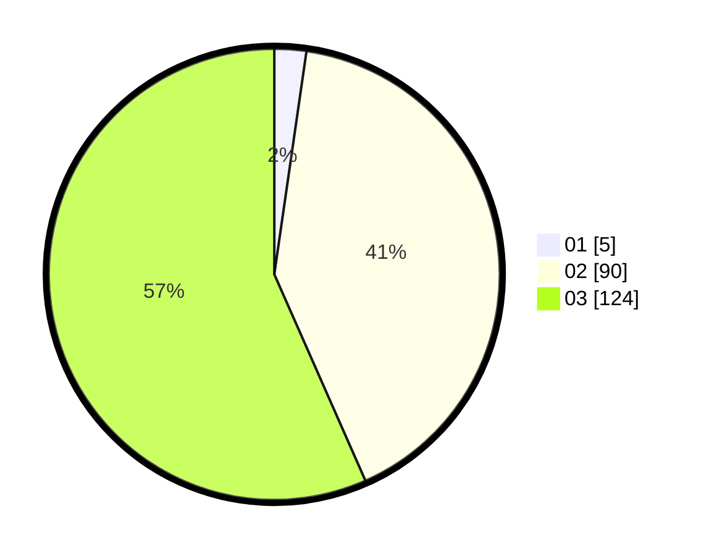

# Hasil

Hasil perolehan suara paslon dapat dilihat pada file paslon-01.txt, paslon-02.txt, dan paslon-03.txt.

Jika tidak ada, artinya data tersebut belum ada pada SIREKAP.

## Perolehan Suara

 * Paslon 01: **5**.
 * Paslon 02: **90**.
 * Paslon 03: **124**.

## Foto C Plano

https://sirekap-obj-formc.kpu.go.id/265e/pemilu/ppwp/31/73/06/10/01/3173061001235-20240214-191314--d2229b4b-01dd-4d09-9ada-6a0fe92562aa.jpg

https://sirekap-obj-formc.kpu.go.id/265e/pemilu/ppwp/31/73/06/10/01/3173061001235-20240214-191440--eae0691a-7bc6-49ba-afd5-e09db4e20655.jpg

https://sirekap-obj-formc.kpu.go.id/265e/pemilu/ppwp/31/73/06/10/01/3173061001235-20240214-191542--318d726a-c792-4e27-be96-466703492924.jpg

## DATA PEMILIH TETAP

Jumlah pemilih dalam DPT: **289**.
 * L: **137**.
 * P: **152**.

## DATA PENGGUNA HAK PILIH

Jumlah pengguna hak pilih dalam DPT: **218**.
 * L: **101**.
 * P: **117**.

Jumlah pengguna hak pilih dalam DPTb: **3**.
 * L: **0**.
 * P: **3**.

Jumlah pengguna hak pilih dalam DPK: **1**.
 * L: **0**.
 * P: **1**.

Jumlah pengguna hak pilih: **222**.
 * L: **101**.
 * P: **121**.

## JUMLAH SUARA SAH DAN TIDAK SAH

JUMLAH SELURUH SUARA SAH: **219**.

JUMLAH SUARA TIDAK SAH: **3**.

JUMLAH SELURUH SUARA SAH DAN SUARA TIDAK SAH: **222**.
