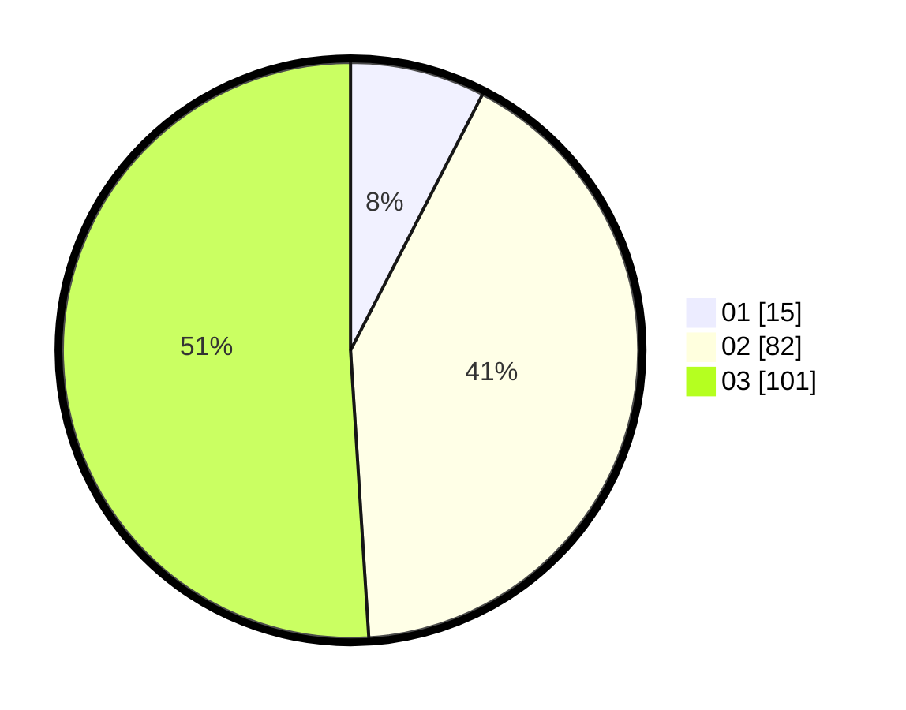

# Hasil

Hasil perolehan suara paslon dapat dilihat pada file paslon-01.txt, paslon-02.txt, dan paslon-03.txt.

Jika tidak ada, artinya data tersebut belum ada pada SIREKAP.

## Perolehan Suara

 * Paslon 01: **15**.
 * Paslon 02: **82**.
 * Paslon 03: **101**.

## Foto C Plano

https://sirekap-obj-formc.kpu.go.id/ca6c/pemilu/ppwp/31/73/06/10/01/3173061001236-20240214-200508--c96f1d50-3dbc-44e8-bcfe-22a9aa2d8bad.jpg

https://sirekap-obj-formc.kpu.go.id/ca6c/pemilu/ppwp/31/73/06/10/01/3173061001236-20240214-200039--a2a18041-44ff-49f3-9eba-384893ca203e.jpg
