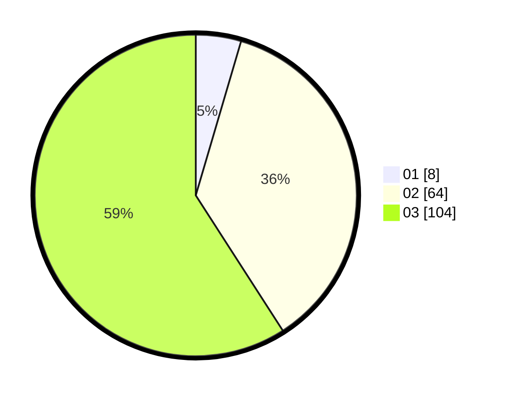

# Hasil

Hasil perolehan suara paslon dapat dilihat pada file paslon-01.txt, paslon-02.txt, dan paslon-03.txt.

Jika tidak ada, artinya data tersebut belum ada pada SIREKAP.

## Perolehan Suara

 * Paslon 01: **8**.
 * Paslon 02: **64**.
 * Paslon 03: **104**.

## Foto C Plano

https://sirekap-obj-formc.kpu.go.id/98da/pemilu/ppwp/31/73/06/10/01/3173061001242-20240214-141340--1c975519-5249-4ce8-8f31-fdb004050343.jpg

https://sirekap-obj-formc.kpu.go.id/98da/pemilu/ppwp/31/73/06/10/01/3173061001242-20240214-141216--ba9f2402-ee7f-41af-ba21-c0a0207065e6.jpg

https://sirekap-obj-formc.kpu.go.id/98da/pemilu/ppwp/31/73/06/10/01/3173061001242-20240214-141303--0a56710d-851e-471e-9641-71f657b142f5.jpg

## DATA PEMILIH TETAP

Jumlah pemilih dalam DPT: **243**.
 * L: **113**.
 * P: **130**.

## DATA PENGGUNA HAK PILIH

Jumlah pengguna hak pilih dalam DPT: **166**.
 * L: **76**.
 * P: **90**.

Jumlah pengguna hak pilih dalam DPTb: **10**.
 * L: **1**.
 * P: **9**.

Jumlah pengguna hak pilih dalam DPK: **2**.
 * L: **2**.
 * P: **0**.

Jumlah pengguna hak pilih: **177**.
 * L: **79**.
 * P: **98**.

## JUMLAH SUARA SAH DAN TIDAK SAH

JUMLAH SELURUH SUARA SAH: **176**.

JUMLAH SUARA TIDAK SAH: **2**.

JUMLAH SELURUH SUARA SAH DAN SUARA TIDAK SAH: **178**.
