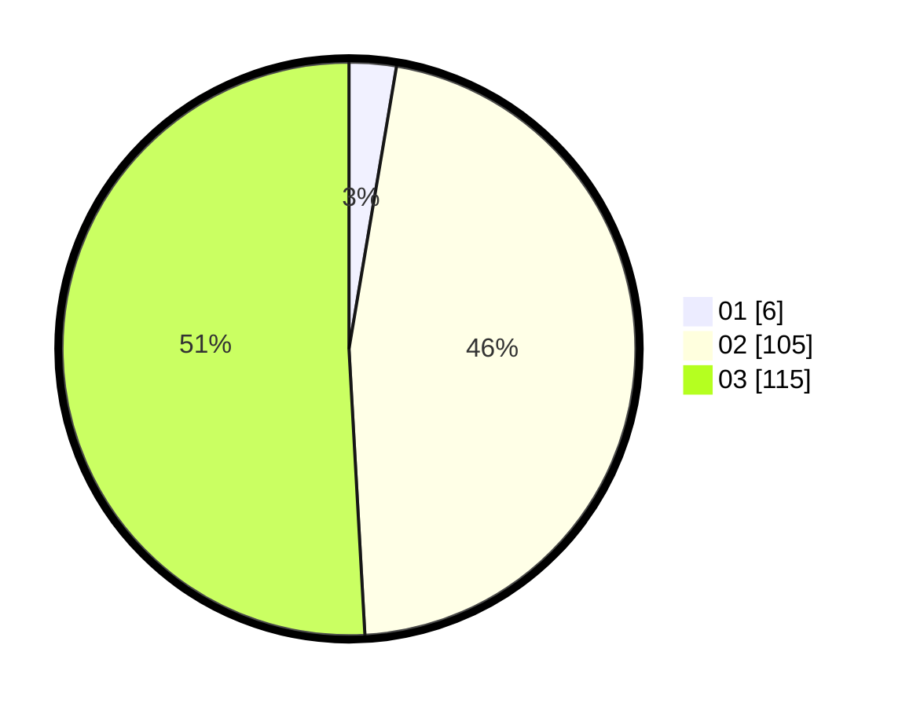

# Hasil

Hasil perolehan suara paslon dapat dilihat pada file paslon-01.txt, paslon-02.txt, dan paslon-03.txt.

Jika tidak ada, artinya data tersebut belum ada pada SIREKAP.

## Perolehan Suara

 * Paslon 01: **6**.
 * Paslon 02: **105**.
 * Paslon 03: **115**.

## Foto C Plano

https://sirekap-obj-formc.kpu.go.id/9b0c/pemilu/ppwp/31/73/06/10/01/3173061001243-20240215-222437--0261977b-0f44-4316-80f6-b45fff7e7593.jpg

https://sirekap-obj-formc.kpu.go.id/9b0c/pemilu/ppwp/31/73/06/10/01/3173061001243-20240215-222439--b92d0e36-57b5-4254-b22c-467c4b12ee4b.jpg

https://sirekap-obj-formc.kpu.go.id/9b0c/pemilu/ppwp/31/73/06/10/01/3173061001243-20240215-222438--b1832ca1-7236-4c78-81d9-d1e57fb80df5.jpg

## DATA PEMILIH TETAP

Jumlah pemilih dalam DPT: **272**.
 * L: **125**.
 * P: **147**.

## DATA PENGGUNA HAK PILIH

Jumlah pengguna hak pilih dalam DPT: **212**.
 * L: **99**.
 * P: **113**.

Jumlah pengguna hak pilih dalam DPTb: **14**.
 * L: **7**.
 * P: **7**.

Jumlah pengguna hak pilih dalam DPK: **1**.
 * L: **1**.
 * P: **0**.

Jumlah pengguna hak pilih: **227**.
 * L: **107**.
 * P: **120**.

## JUMLAH SUARA SAH DAN TIDAK SAH

JUMLAH SELURUH SUARA SAH: **226**.

JUMLAH SUARA TIDAK SAH: **1**.

JUMLAH SELURUH SUARA SAH DAN SUARA TIDAK SAH: **227**.
