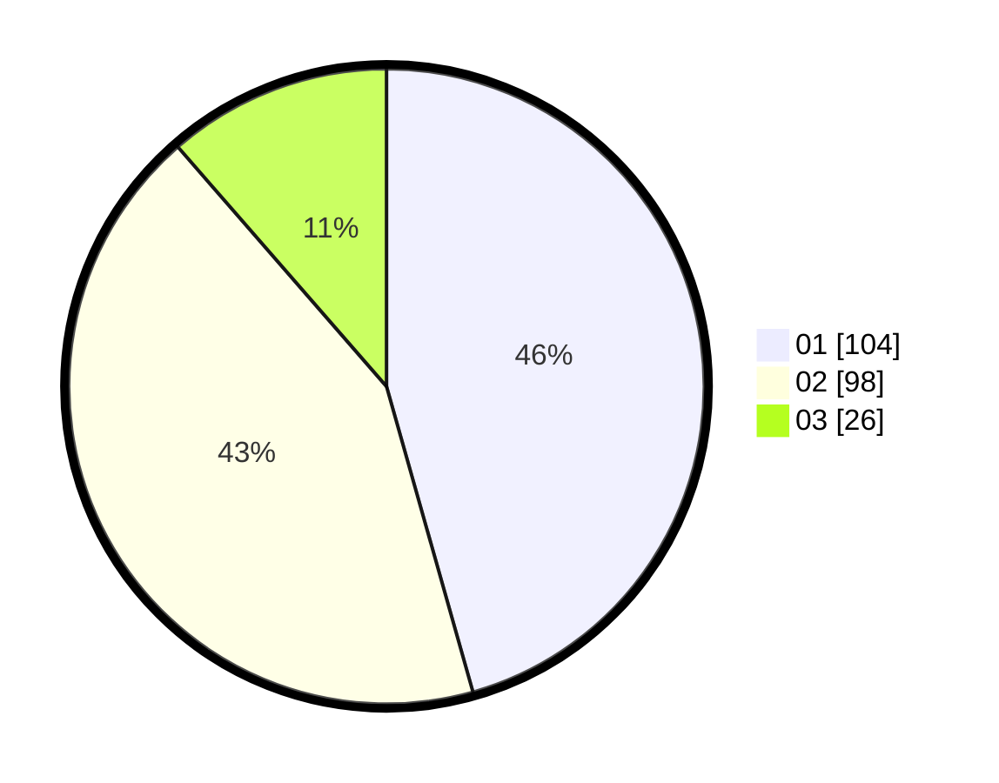

# Hasil

Hasil perolehan suara paslon dapat dilihat pada file paslon-01.txt, paslon-02.txt, dan paslon-03.txt.

Jika tidak ada, artinya data tersebut belum ada pada SIREKAP.

## Perolehan Suara

 * Paslon 01: **104**.
 * Paslon 02: **98**.
 * Paslon 03: **26**.

## Foto C Plano

https://sirekap-obj-formc.kpu.go.id/2146/pemilu/ppwp/31/73/06/10/02/3173061002001-20240215-012136--ae1cd21a-76eb-4ff2-93d3-4d899ac4f4dd.jpg

https://sirekap-obj-formc.kpu.go.id/2146/pemilu/ppwp/31/73/06/10/02/3173061002001-20240215-012225--f703fe71-1ee6-4171-92ee-342cb4f7d506.jpg

https://sirekap-obj-formc.kpu.go.id/2146/pemilu/ppwp/31/73/06/10/02/3173061002001-20240215-012339--77fc7405-31a4-4107-a52c-15c163fc8c69.jpg
