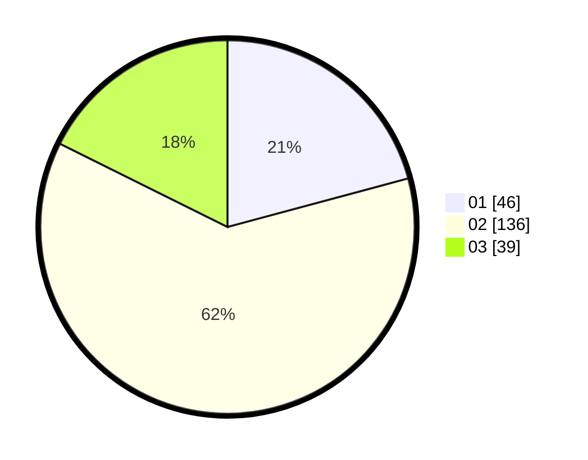

# Hasil

Hasil perolehan suara paslon dapat dilihat pada file paslon-01.txt, paslon-02.txt, dan paslon-03.txt.

Jika tidak ada, artinya data tersebut belum ada pada SIREKAP.

## Perolehan Suara

 * Paslon 01: **46**.
 * Paslon 02: **136**.
 * Paslon 03: **39**.

## Foto C Plano

https://sirekap-obj-formc.kpu.go.id/9306/pemilu/ppwp/31/73/06/10/02/3173061002004-20240214-222637--f644ad8f-3329-4921-acbe-82b45615ba43.jpg

https://sirekap-obj-formc.kpu.go.id/9306/pemilu/ppwp/31/73/06/10/02/3173061002004-20240214-222641--669da232-5e7a-41d0-be7b-b1f9848527af.jpg

https://sirekap-obj-formc.kpu.go.id/9306/pemilu/ppwp/31/73/06/10/02/3173061002004-20240214-222645--df9d4b63-5cbb-4108-bc7a-59eab26a29dd.jpg
