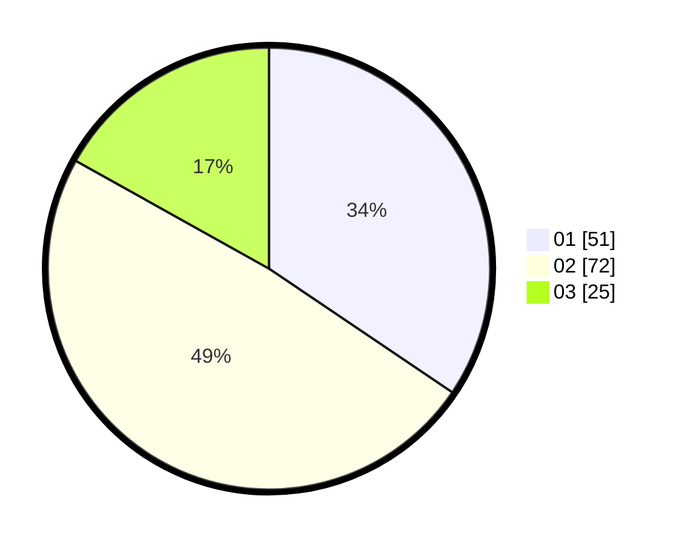

# Hasil

Hasil perolehan suara paslon dapat dilihat pada file paslon-01.txt, paslon-02.txt, dan paslon-03.txt.

Jika tidak ada, artinya data tersebut belum ada pada SIREKAP.

## Perolehan Suara

 * Paslon 01: **51**.
 * Paslon 02: **72**.
 * Paslon 03: **25**.

## Foto C Plano

https://sirekap-obj-formc.kpu.go.id/bf9c/pemilu/ppwp/31/73/06/10/02/3173061002005-20240214-203034--f73e9d76-26fc-4021-a2da-dec97b1c8cef.jpg

https://sirekap-obj-formc.kpu.go.id/bf9c/pemilu/ppwp/31/73/06/10/02/3173061002005-20240214-211643--98893f45-067e-4a4a-8867-7530f58944a5.jpg

https://sirekap-obj-formc.kpu.go.id/bf9c/pemilu/ppwp/31/73/06/10/02/3173061002005-20240214-221250--612379a8-f387-4c98-98bd-ada4d7f5cc6a.jpg
