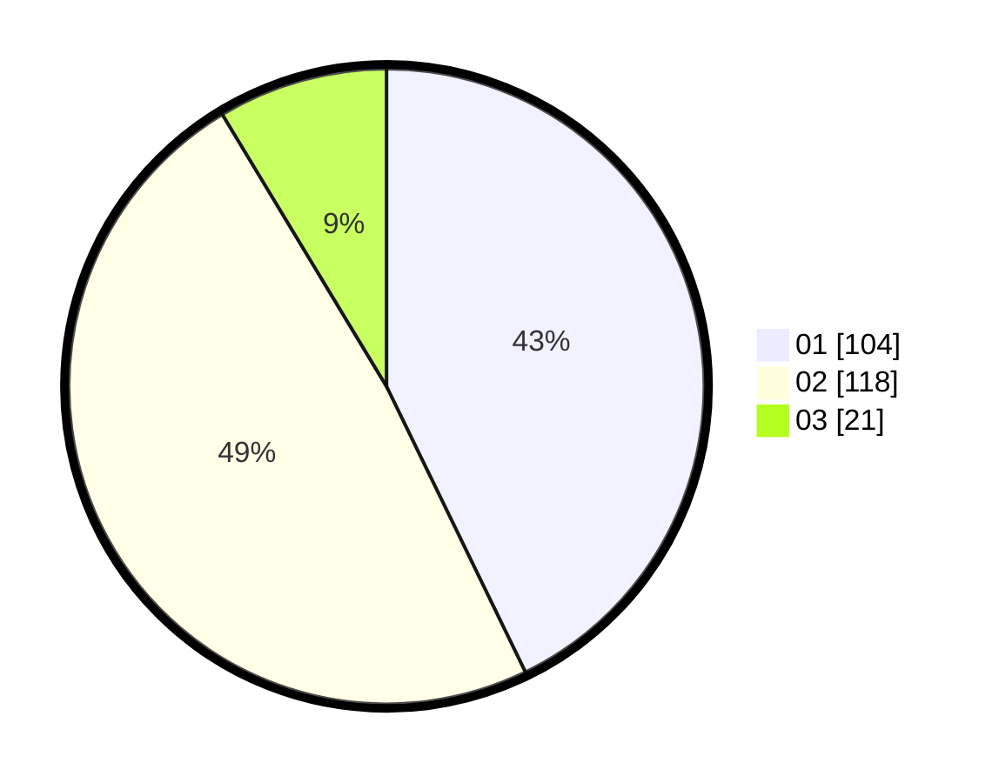

# Hasil

Hasil perolehan suara paslon dapat dilihat pada file paslon-01.txt, paslon-02.txt, dan paslon-03.txt.

Jika tidak ada, artinya data tersebut belum ada pada SIREKAP.

## Perolehan Suara

 * Paslon 01: **104**.
 * Paslon 02: **118**.
 * Paslon 03: **21**.

## Foto C Plano

https://sirekap-obj-formc.kpu.go.id/2927/pemilu/ppwp/31/73/06/10/02/3173061002006-20240214-210232--8b33e43c-5927-446c-92b0-cb5c69ff32f8.jpg

https://sirekap-obj-formc.kpu.go.id/2927/pemilu/ppwp/31/73/06/10/02/3173061002006-20240214-202045--3492cb1f-6971-4bcd-b829-33e8fb3403ff.jpg

https://sirekap-obj-formc.kpu.go.id/2927/pemilu/ppwp/31/73/06/10/02/3173061002006-20240214-202943--3dd4aa9e-7149-4f27-928c-dbc4729a4440.jpg
