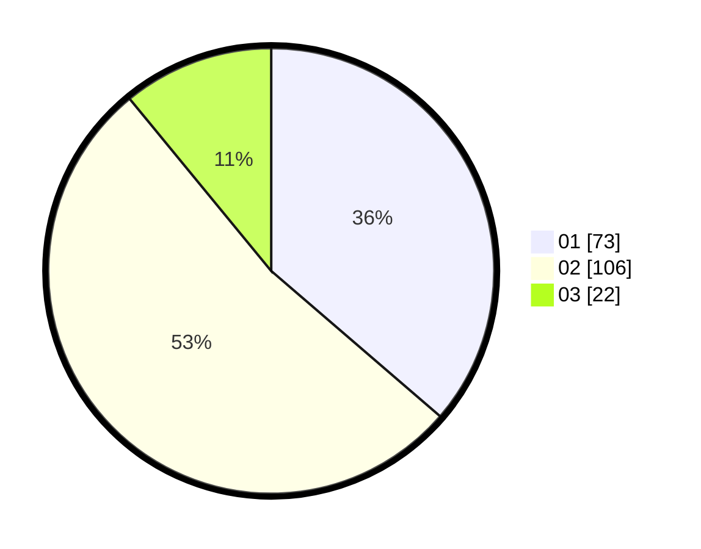

# Hasil

Hasil perolehan suara paslon dapat dilihat pada file paslon-01.txt, paslon-02.txt, dan paslon-03.txt.

Jika tidak ada, artinya data tersebut belum ada pada SIREKAP.

## Perolehan Suara

 * Paslon 01: **73**.
 * Paslon 02: **106**.
 * Paslon 03: **22**.

## Foto C Plano

https://sirekap-obj-formc.kpu.go.id/c568/pemilu/ppwp/31/73/06/10/02/3173061002012-20240214-155346--eeb3c851-19ff-4f34-9920-530a0982d475.jpg

https://sirekap-obj-formc.kpu.go.id/c568/pemilu/ppwp/31/73/06/10/02/3173061002012-20240214-185910--c5273d6f-2269-4efe-a8a6-1857f03265d6.jpg

https://sirekap-obj-formc.kpu.go.id/c568/pemilu/ppwp/31/73/06/10/02/3173061002012-20240214-185943--1463c7d8-a902-4c87-a35a-74284ac417d1.jpg

## DATA PEMILIH TETAP

Jumlah pemilih dalam DPT: **286**.
 * L: **145**.
 * P: **141**.

## DATA PENGGUNA HAK PILIH

Jumlah pengguna hak pilih dalam DPT: **201**.
 * L: **99**.
 * P: **102**.

Jumlah pengguna hak pilih dalam DPTb: **0**.
 * L: **0**.
 * P: **0**.

Jumlah pengguna hak pilih dalam DPK: **1**.
 * L: **0**.
 * P: **1**.

Jumlah pengguna hak pilih: **202**.
 * L: **99**.
 * P: **103**.

## JUMLAH SUARA SAH DAN TIDAK SAH

JUMLAH SELURUH SUARA SAH: **201**.

JUMLAH SUARA TIDAK SAH: **1**.

JUMLAH SELURUH SUARA SAH DAN SUARA TIDAK SAH: **202**.
