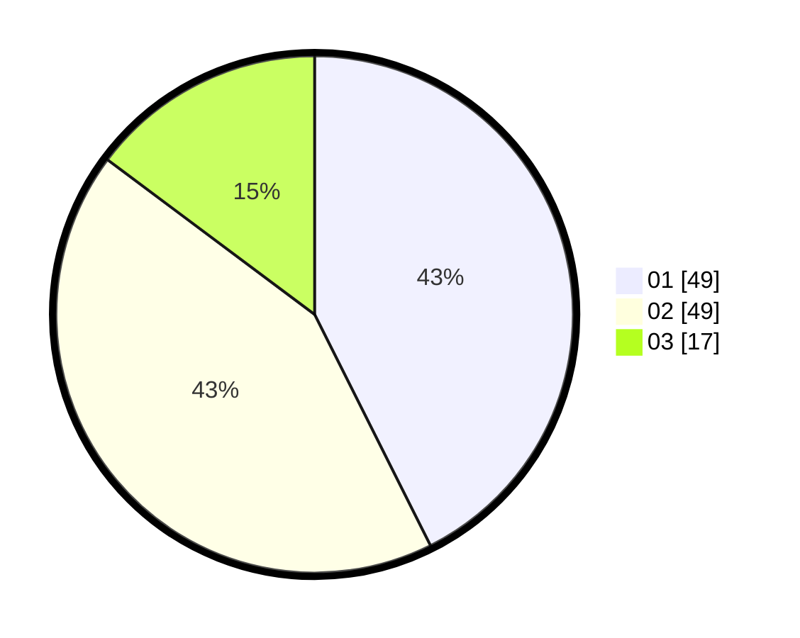

# Hasil

Hasil perolehan suara paslon dapat dilihat pada file paslon-01.txt, paslon-02.txt, dan paslon-03.txt.

Jika tidak ada, artinya data tersebut belum ada pada SIREKAP.

## Perolehan Suara

 * Paslon 01: **49**.
 * Paslon 02: **49**.
 * Paslon 03: **17**.

## Foto C Plano

https://sirekap-obj-formc.kpu.go.id/4a5a/pemilu/ppwp/31/73/06/10/02/3173061002013-20240216-141015--a0b51901-5563-4800-870c-24ee0582b83e.jpg

https://sirekap-obj-formc.kpu.go.id/4a5a/pemilu/ppwp/31/73/06/10/02/3173061002013-20240216-141016--68a6df79-d82a-41e3-a655-5c9f9ede8053.jpg

https://sirekap-obj-formc.kpu.go.id/4a5a/pemilu/ppwp/31/73/06/10/02/3173061002013-20240216-141015--1ca4e704-a15e-4ea4-a09f-ecab8c34336b.jpg

## DATA PEMILIH TETAP

Jumlah pemilih dalam DPT: **151**.
 * L: **79**.
 * P: **72**.

## DATA PENGGUNA HAK PILIH

Jumlah pengguna hak pilih dalam DPT: **109**.
 * L: **52**.
 * P: **57**.

Jumlah pengguna hak pilih dalam DPTb: **6**.
 * L: **3**.
 * P: **3**.

Jumlah pengguna hak pilih dalam DPK: **0**.
 * L: **0**.
 * P: **0**.

Jumlah pengguna hak pilih: **115**.
 * L: **55**.
 * P: **60**.

## JUMLAH SUARA SAH DAN TIDAK SAH

JUMLAH SELURUH SUARA SAH: **115**.

JUMLAH SUARA TIDAK SAH: **0**.

JUMLAH SELURUH SUARA SAH DAN SUARA TIDAK SAH: **115**.
