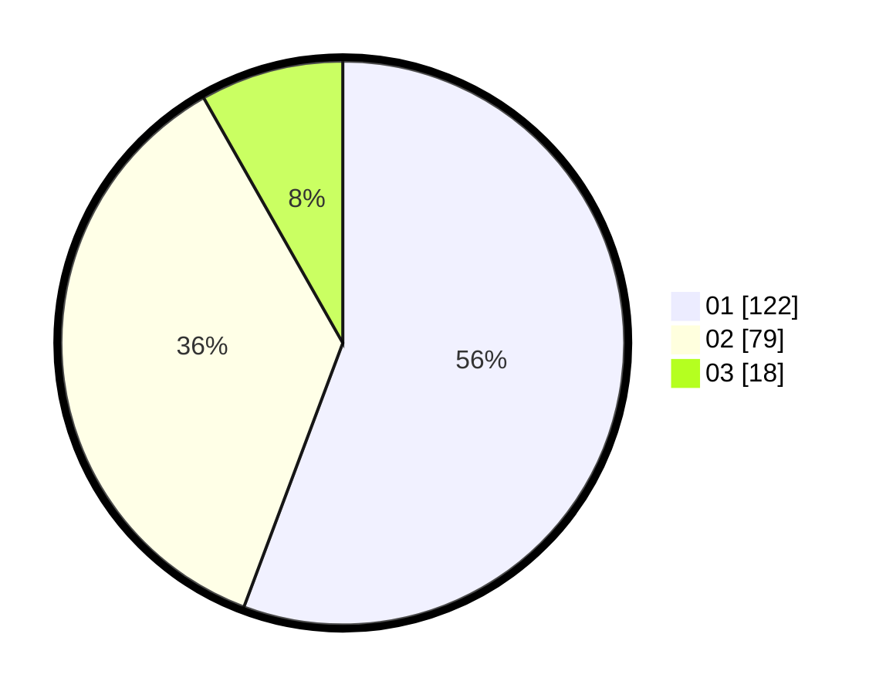

# Hasil

Hasil perolehan suara paslon dapat dilihat pada file paslon-01.txt, paslon-02.txt, dan paslon-03.txt.

Jika tidak ada, artinya data tersebut belum ada pada SIREKAP.

## Perolehan Suara

 * Paslon 01: **122**.
 * Paslon 02: **79**.
 * Paslon 03: **18**.

## Foto C Plano

https://sirekap-obj-formc.kpu.go.id/559b/pemilu/ppwp/31/73/06/10/02/3173061002023-20240215-015320--25deb769-8963-4b5f-8d19-15383a5dbb49.jpg

https://sirekap-obj-formc.kpu.go.id/559b/pemilu/ppwp/31/73/06/10/02/3173061002023-20240215-015531--b4fb3b9c-2333-4e51-a63f-2c0046ea4cdf.jpg

https://sirekap-obj-formc.kpu.go.id/559b/pemilu/ppwp/31/73/06/10/02/3173061002023-20240215-015620--8457d595-e9d0-49ac-91b7-dcd580c2a208.jpg

## DATA PEMILIH TETAP

Jumlah pemilih dalam DPT: **280**.
 * L: **131**.
 * P: **149**.

## DATA PENGGUNA HAK PILIH

Jumlah pengguna hak pilih dalam DPT: **214**.
 * L: **96**.
 * P: **118**.

Jumlah pengguna hak pilih dalam DPTb: **2**.
 * L: **0**.
 * P: **2**.

Jumlah pengguna hak pilih dalam DPK: **5**.
 * L: **4**.
 * P: **1**.

Jumlah pengguna hak pilih: **221**.
 * L: **100**.
 * P: **121**.

## JUMLAH SUARA SAH DAN TIDAK SAH

JUMLAH SELURUH SUARA SAH: **219**.

JUMLAH SUARA TIDAK SAH: **2**.

JUMLAH SELURUH SUARA SAH DAN SUARA TIDAK SAH: **221**.
