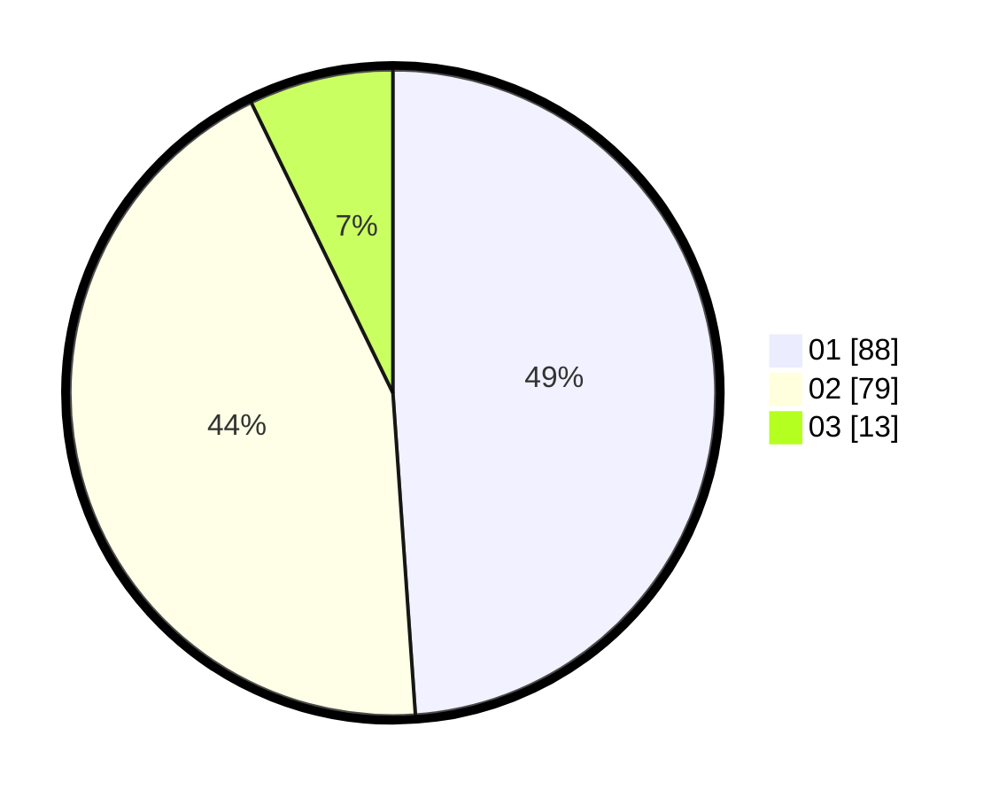

# Hasil

Hasil perolehan suara paslon dapat dilihat pada file paslon-01.txt, paslon-02.txt, dan paslon-03.txt.

Jika tidak ada, artinya data tersebut belum ada pada SIREKAP.

## Perolehan Suara

 * Paslon 01: **88**.
 * Paslon 02: **79**.
 * Paslon 03: **13**.

## Foto C Plano

https://sirekap-obj-formc.kpu.go.id/a515/pemilu/ppwp/31/73/06/10/02/3173061002026-20240215-002608--677721c4-b7a3-4e92-aa2a-9ab528db1eff.jpg

https://sirekap-obj-formc.kpu.go.id/a515/pemilu/ppwp/31/73/06/10/02/3173061002026-20240215-002654--408c1cf5-fad9-4aa9-9ee5-4caadca9906a.jpg

https://sirekap-obj-formc.kpu.go.id/a515/pemilu/ppwp/31/73/06/10/02/3173061002026-20240215-002819--1d71ed6a-a805-4cb5-88eb-ed96bfee3919.jpg

## DATA PEMILIH TETAP

Jumlah pemilih dalam DPT: **270**.
 * L: **137**.
 * P: **133**.

## DATA PENGGUNA HAK PILIH

Jumlah pengguna hak pilih dalam DPT: **177**.
 * L: **85**.
 * P: **92**.

Jumlah pengguna hak pilih dalam DPTb: **0**.
 * L: **0**.
 * P: **0**.

Jumlah pengguna hak pilih dalam DPK: **6**.
 * L: **3**.
 * P: **3**.

Jumlah pengguna hak pilih: **183**.
 * L: **88**.
 * P: **95**.

## JUMLAH SUARA SAH DAN TIDAK SAH

JUMLAH SELURUH SUARA SAH: **180**.

JUMLAH SUARA TIDAK SAH: **3**.

JUMLAH SELURUH SUARA SAH DAN SUARA TIDAK SAH: **183**.
