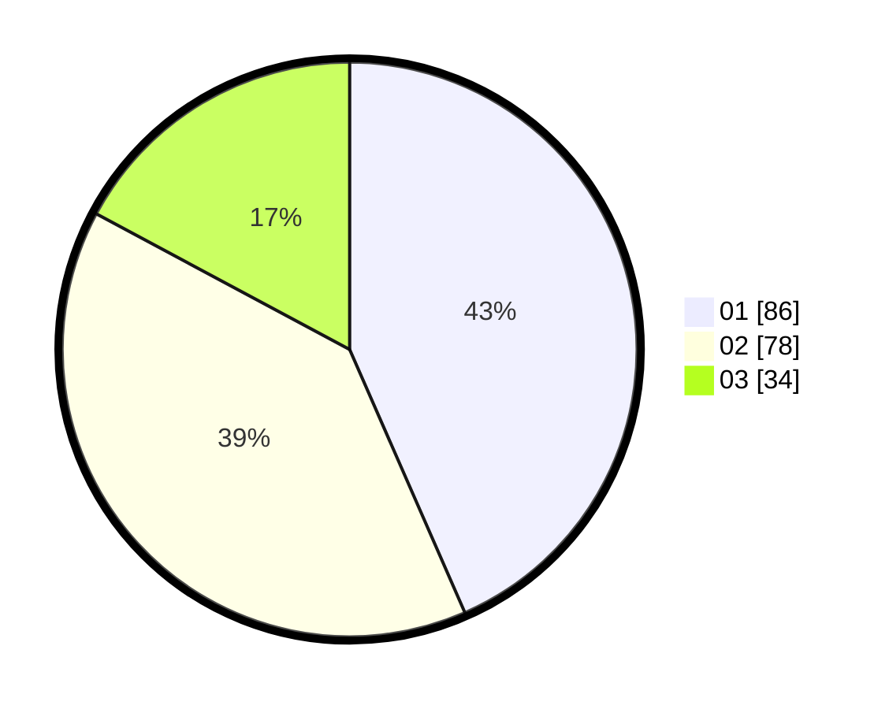

# Hasil

Hasil perolehan suara paslon dapat dilihat pada file paslon-01.txt, paslon-02.txt, dan paslon-03.txt.

Jika tidak ada, artinya data tersebut belum ada pada SIREKAP.

## Perolehan Suara

 * Paslon 01: **86**.
 * Paslon 02: **78**.
 * Paslon 03: **34**.

## Foto C Plano

https://sirekap-obj-formc.kpu.go.id/5c8d/pemilu/ppwp/31/73/06/10/02/3173061002027-20240214-233053--694950c1-cad2-4f8f-bd26-ff34170f1f38.jpg

https://sirekap-obj-formc.kpu.go.id/5c8d/pemilu/ppwp/31/73/06/10/02/3173061002027-20240214-184544--f6dbdcaa-20e2-43fc-8e06-1d2915146b5d.jpg

https://sirekap-obj-formc.kpu.go.id/5c8d/pemilu/ppwp/31/73/06/10/02/3173061002027-20240214-233619--0db3fec8-209e-442a-b4d6-593b369cf2d2.jpg

## DATA PEMILIH TETAP

Jumlah pemilih dalam DPT: **266**.
 * L: **137**.
 * P: **129**.

## DATA PENGGUNA HAK PILIH

Jumlah pengguna hak pilih dalam DPT: **198**.
 * L: **100**.
 * P: **98**.

Jumlah pengguna hak pilih dalam DPTb: **0**.
 * L: **0**.
 * P: **0**.

Jumlah pengguna hak pilih dalam DPK: **1**.
 * L: **1**.
 * P: **0**.

Jumlah pengguna hak pilih: **199**.
 * L: **101**.
 * P: **98**.

## JUMLAH SUARA SAH DAN TIDAK SAH

JUMLAH SELURUH SUARA SAH: **198**.

JUMLAH SUARA TIDAK SAH: **1**.

JUMLAH SELURUH SUARA SAH DAN SUARA TIDAK SAH: **199**.
