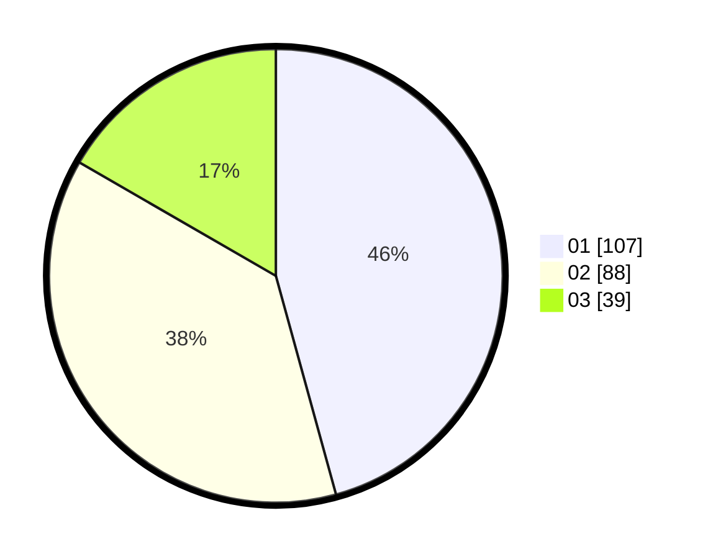

# Hasil

Hasil perolehan suara paslon dapat dilihat pada file paslon-01.txt, paslon-02.txt, dan paslon-03.txt.

Jika tidak ada, artinya data tersebut belum ada pada SIREKAP.

## Perolehan Suara

 * Paslon 01: **107**.
 * Paslon 02: **88**.
 * Paslon 03: **39**.

## Foto C Plano

https://sirekap-obj-formc.kpu.go.id/61d6/pemilu/ppwp/31/73/06/10/02/3173061002031-20240214-211240--4fc195e2-7358-4cb7-aadb-0d985e55d344.jpg

https://sirekap-obj-formc.kpu.go.id/61d6/pemilu/ppwp/31/73/06/10/02/3173061002031-20240215-003843--377d6999-ea52-4384-9270-c8153ef85898.jpg

https://sirekap-obj-formc.kpu.go.id/61d6/pemilu/ppwp/31/73/06/10/02/3173061002031-20240214-211507--06b01361-acfc-4004-8ef3-d3d3cae56932.jpg

## DATA PEMILIH TETAP

Jumlah pemilih dalam DPT: **234**.
 * L: **118**.
 * P: **116**.

## DATA PENGGUNA HAK PILIH

Jumlah pengguna hak pilih dalam DPT: **234**.
 * L: **118**.
 * P: **116**.

Jumlah pengguna hak pilih dalam DPTb: **2**.
 * L: **0**.
 * P: **2**.

Jumlah pengguna hak pilih dalam DPK: **1**.
 * L: **1**.
 * P: **0**.

Jumlah pengguna hak pilih: **237**.
 * L: **119**.
 * P: **118**.

## JUMLAH SUARA SAH DAN TIDAK SAH

JUMLAH SELURUH SUARA SAH: **234**.

JUMLAH SUARA TIDAK SAH: **3**.

JUMLAH SELURUH SUARA SAH DAN SUARA TIDAK SAH: **237**.
